# Day2 フィジカルコンピューティング：基礎・入力・出力

---

## 今日やること

- フィジカルコンピューティングの基本を知る
- micro:bit と MakeCode を使って動かす
- 入力センサーと出力を試す
- AIでコードを作って、読んで、説明する

---

## この日の位置づけ

- Day1 で見た「AI時代のものづくり」を実際に手を動かして体験する日
- 1コマ目で概念と入力、2コマ目で出力まで触る
- Day3 の応用制作につながる土台を作る

---

## アイスブレイク

身の回りで「センサーが動かしているもの」を1つ挙げてみよう

- 自動ドア
- スマホの画面回転
- ゲームコントローラーの振動
- 自動点灯の照明

---

## フィジカルコンピューティングとは

- デジタルと物理世界をつなぐ考え方
- センサーで入力を受け取る
- プログラムで処理する
- 光・音・動きなどで出力する

---

## 例

- インタラクティブアート
- スマート家電・IoT
- ロボット制御
- 自動運転
- AIとセンサーを組み合わせた作品

teamLab 公式: https://www.teamlab.art/concept/lightsculpture-point/

---

## 例: 仕組みを分解して見られる作品

Exploratorium 掲載の Zimoun 作品解説: https://www.exploratorium.edu/exhibits/405-prepared-dc-motors-cotton-balls-cardboard-boxes-46x46x46

---

## AI時代のフィジカルコンピューティング

- センサーデータを AI と組み合わせると表現の幅が広がる
- コード生成 AI で試作の速度が上がる
- アイデアを考え、AIと一緒に実装する流れが取りやすい

---

## 入力 → 処理 → 出力

- 入力: ボタン、加速度、温度、光、音
- 処理: 条件分岐、変数、繰り返し
- 出力: LED、音

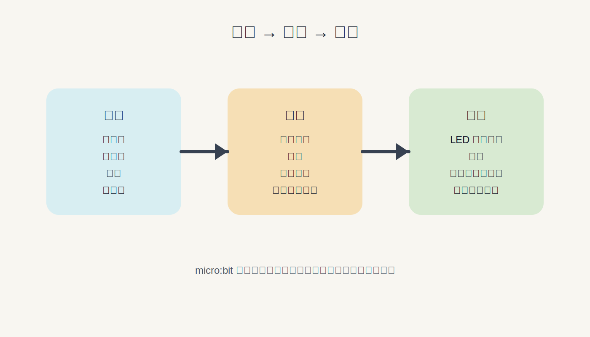

---

## 今日使うもの

- micro:bit
- MakeCode
- ブラウザ
- AI チャット

MakeCode:
https://makecode.microbit.org/

---

## micro:bit の各部位

- 5x5 LED マトリクス
- ボタン A / B
- 加速度センサー
- 温度センサー
- 光センサー
- コンパス
- スピーカー

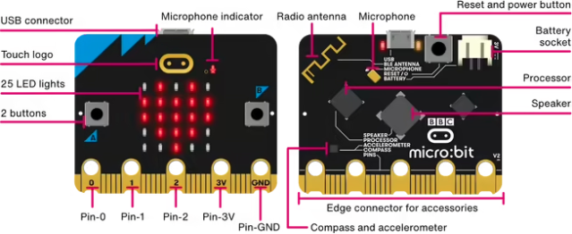

---

## MakeCode の基本

- ブラウザで開く
- ブロックと JavaScript を切り替えられる
- シミュレーターで動作確認できる
- 実機にも書き込める

MakeCode:
https://makecode.microbit.org/

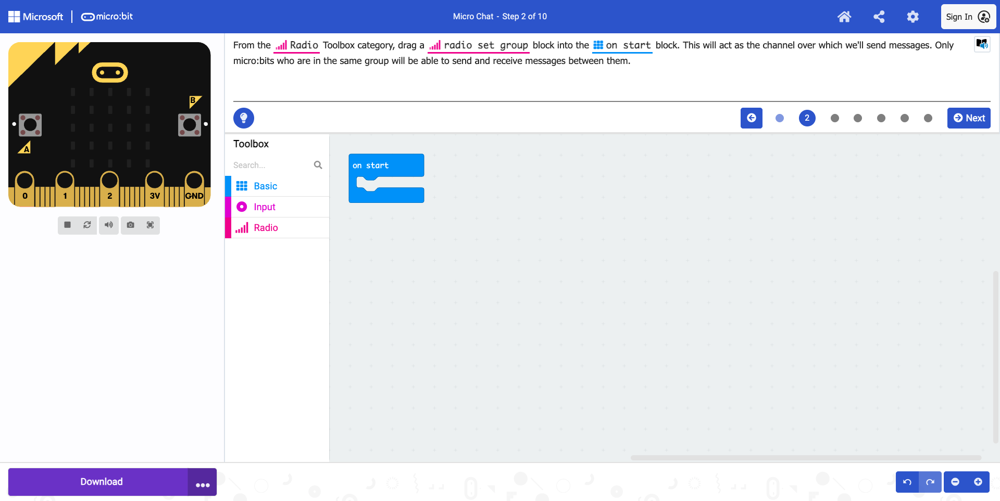

---

## 実習: チュートリアル

- 公式チュートリアルを進める
- 各ブロックが何をしているか確認する
- ブロックと動作の対応を見る

---

## 提出課題: チュートリアル

- 画面のスクリーンショットを1枚
- 試した内容と理解したことを1〜2文

例:
「ボタンを押すと表示が変わるチュートリアルを試した。入力を受け取って LED 表示を変える流れがわかった」

---

## AIを使ったコード生成

- 「MakeCode JavaScript で」と指定する
- 出力されたコードを貼り付けて動かす
- 動いたらコードを読む
- わからない部分は AI に聞く

---

## AIは「答える道具」だけではない

- AI に答えを丸投げするだけでは、案が浅くなりやすい
- AI を「問いかける相棒」として使うと、発想が広がる
- 自分の体験や興味を入れると、案が自分らしくなる
- 最初の思いつきで止まらず、複数案を比べることが大事

例:
`作品の方向性を考えたいので、まず私に一つずつ質問して`

---

## 実習: AIで作る

- ボタンAを押すたびにカウントアップして LED に表示
- 振るとランダムなアイコンを表示
- 動いたコードを自分の言葉で説明する

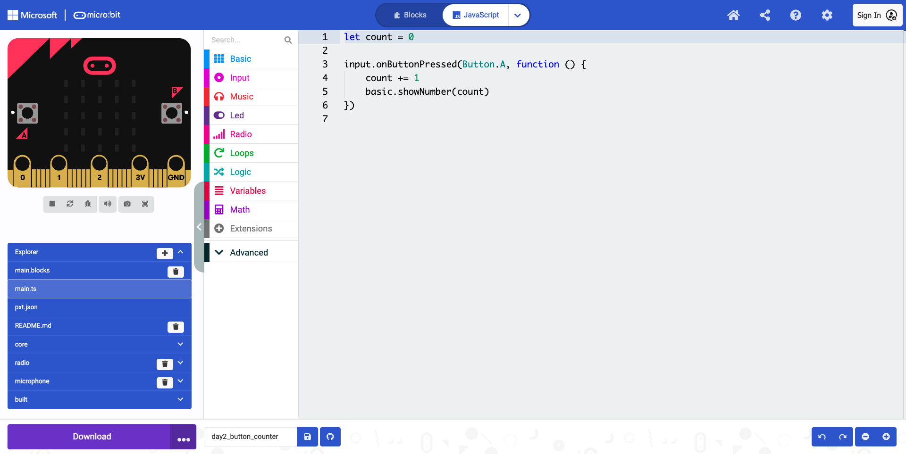
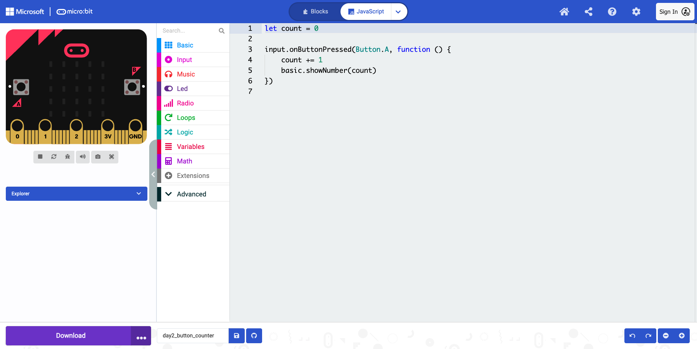

---

## 実習: AIで作る 2

- 振るとランダムなアイコンを表示
- 入力と出力の対応を確認する

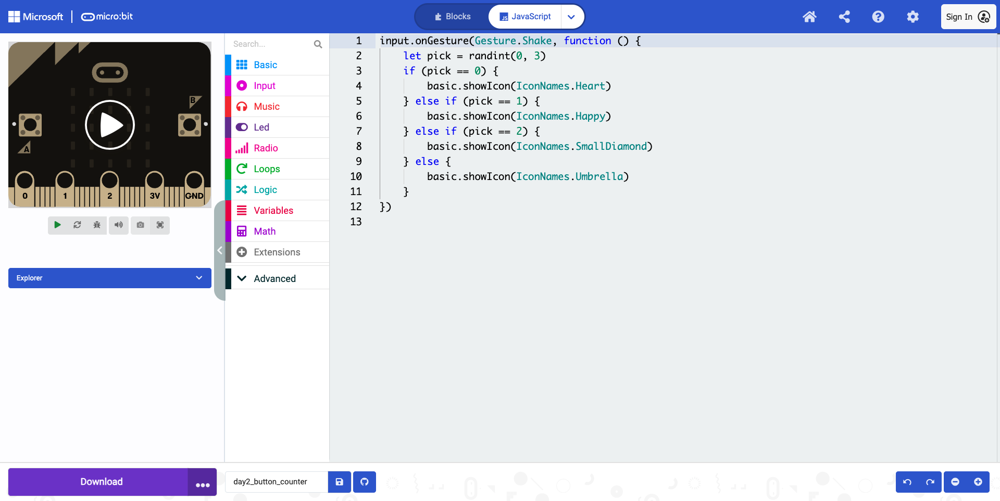
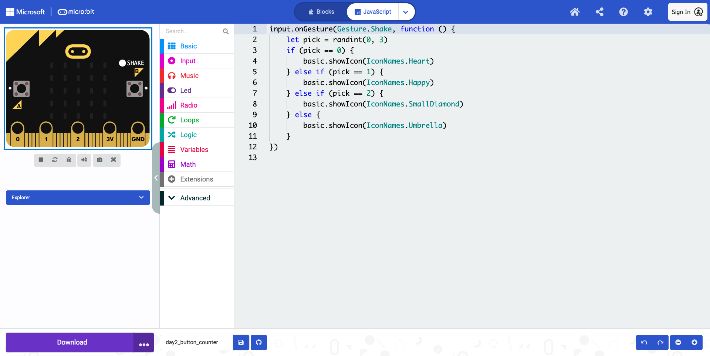

---

## 提出課題: AIコード生成

- プログラムの画面キャプチャを1〜2枚
- 実機写真またはシミュレーター画面
- 入力と出力の説明を2〜3文
- AIに投げたプロンプトのメモ

例:
「ボタンAを押すと数字が1ずつ増えてLEDに表示される。micro:bit を振るとランダムなアイコンが出る。入力によって違う表示が起きるようにした」

---

## 入力センサー一覧

| センサー | 取得できる値の例 |
| --- | --- |
| ボタン A / B | 押す / 離す / 長押し |
| 加速度センサー | X / Y / Z 軸、振った強さ |
| 温度センサー | 温度 |
| 光センサー | 明るさ |
| マイク | 音の大きさ |

---

## 出力

- LEDマトリクスでできること
  - アイコン表示
  - 文字スクロール
  - 座標指定
  - アニメーション
- スピーカーでできること
  - 音階
  - メロディ
  - 値に応じた音の変化

---

## 実習: 出力プログラム

- LED にアニメーションを表示する
- 温度が高いほど音が高くなるプログラムを作る
- コードを読んで何をしているか説明する

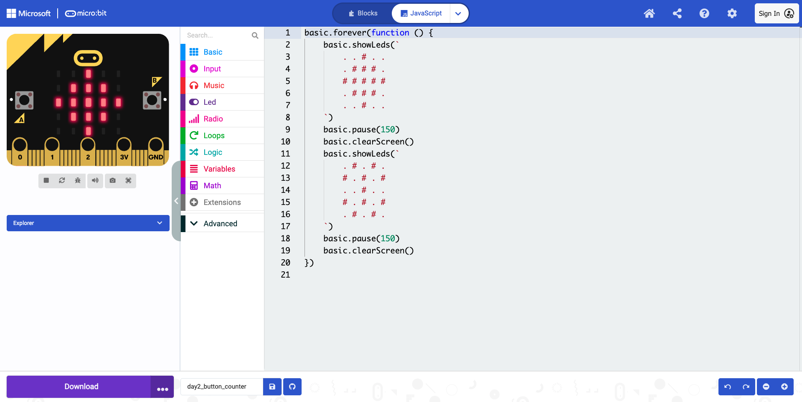
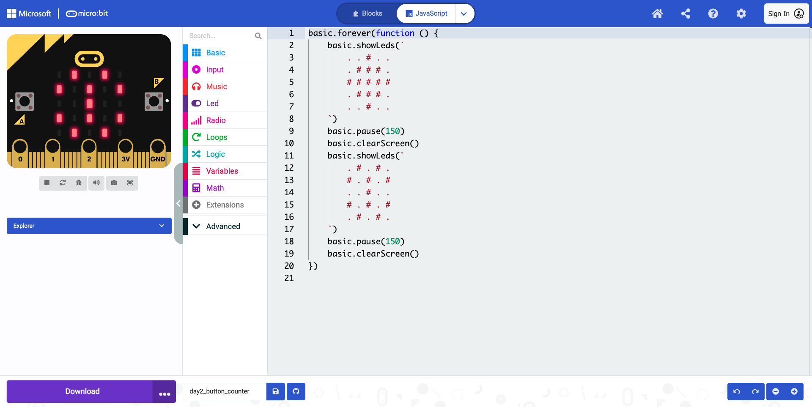

---

## 実習: 出力プログラム 2

- 温度が高いほど音が高くなる
- センサー値と音の変化を確認する

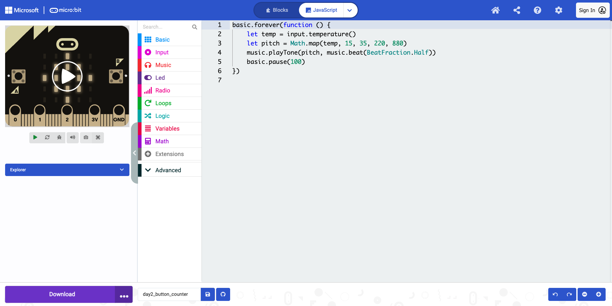
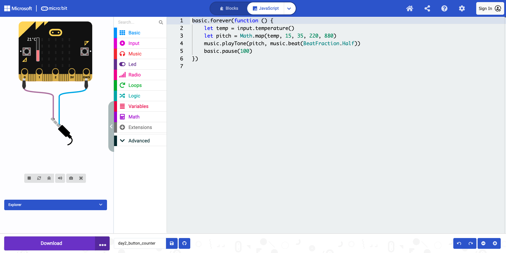

---

## 提出課題: 出力実習

- 画面キャプチャを1枚
- 実機写真またはシミュレーター画面
- センサー値と出力の変化を2〜3文

例:
「温度センサーの値を使って音の高さを変えた。温度が上がるほど高い音が鳴るようにした。LEDには動いていることがわかるよう簡単なアニメーションを表示した」

---

## コードを読むための基本概念

- 変数: 値を覚えておく
- 論理: 条件で分ける
- ループ: 繰り返す

---

## 実習: コード読解

- ループがどこにあるか
- `if` が何を判断しているか
- 変数が何を記憶しているか
- わからない部分は AI に質問する

---

## 提出課題: コード読解

- 使ったコードを1つ選ぶ
- ループ・論理・変数を短く説明する
- AIに質問した内容があればメモする

例:
「`count` という変数でボタンを押した回数を記録している。`if` で回数が5回になったかを判断している。`forever` で表示を繰り返している」

---

## デモ: フィジカルとデジタルをつなぐ

- micro:bit のセンサー値をブラウザに送る
- HTML/JS のゲームを動かす
- Day4 以降のアプリ開発につながる

サンプル:
`./demo/serial_shooter/index.html`

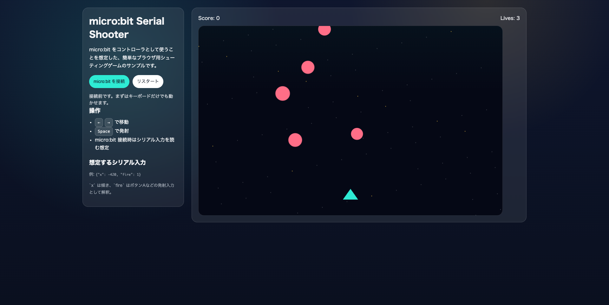

---

## デモを AI に作らせるとき

プロンプト例:
`micro:bit から Web Serial で {"x": 数値, "fire": 0 or 1} の JSON を受け取り、傾きで左右移動し、fire で弾を撃つ簡単なシューティングゲームを index.html 1ファイルで作って`

テキストファイル編集:
`index.html` や `microbit_controller.js` を編集するには VS Code などのエディタが必要
https://code.visualstudio.com/download

---

## まとめ

- 入力と出力の基本を触った
- AIでコードを作って説明するところまでやった
- 次回は入力と出力を組み合わせて作品を作る
