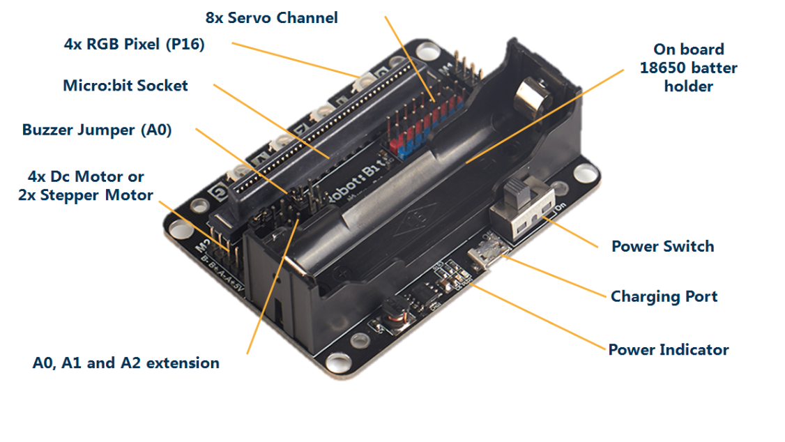
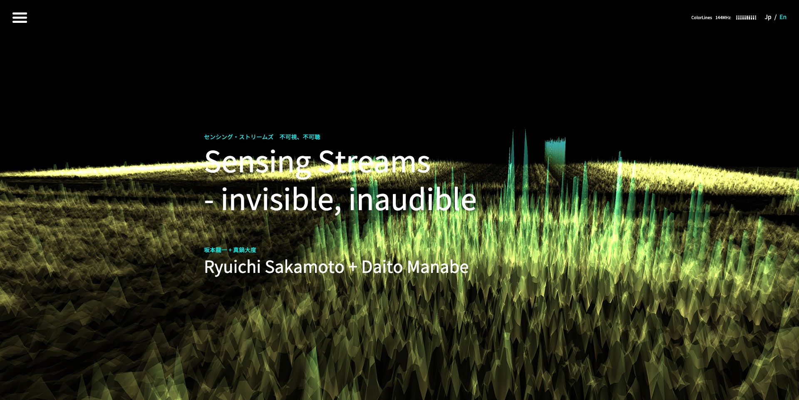
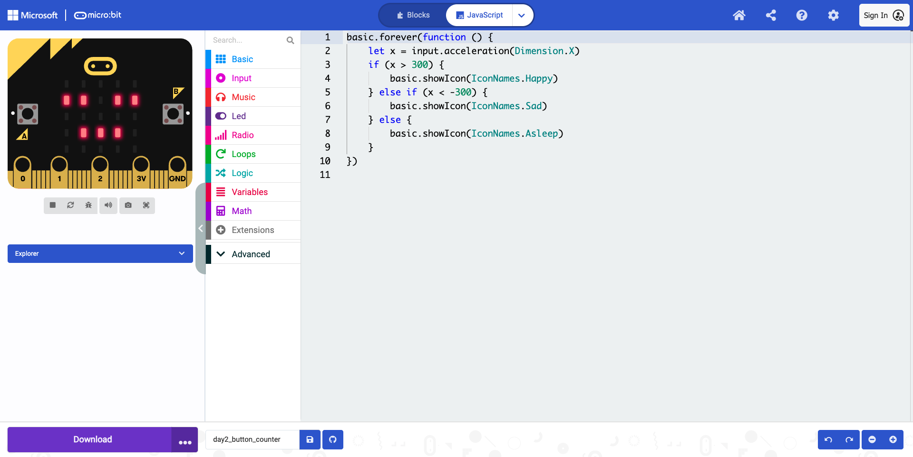
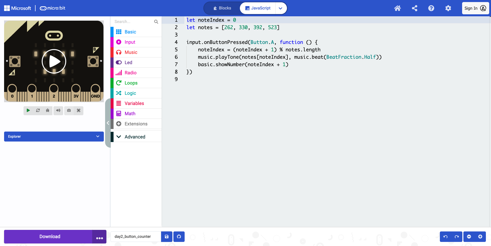
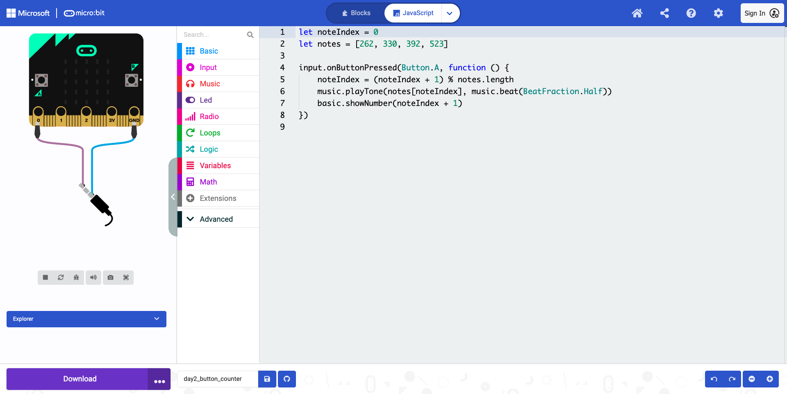

# Day3 フィジカルコンピューティング：応用・組み合わせ

---

## 今日やること

- Day2 の内容を復習する
- 入力と出力を組み合わせる
- AI を使ってアイデアを深掘りする
- ミニ作品を作って発表する

---

## この日の位置づけ

- まず復習から入り、前回の内容を思い出す
- 入力・処理・出力の流れを確認する
- 応用プログラムを作る
- 後半は個人でミニ作品を制作する

---

## アイスブレイク

Day2 で一番面白かった / 驚いたことは何だった？

---

## 復習

- Day2 のコードを見直す
- 入力・処理・出力を説明できるようにする
- ループ・論理・変数がどこにあるか確認する
- 1つ変更して動作の違いを見る

---

## 提出課題: 復習実習

- 見直したコードの画面キャプチャを1枚
- 入力と出力の説明を1〜2文
- 変更した箇所と結果を1〜2文

例:
「ボタンAの入力を受け取ると、LEDの表示が変わるプログラムを見直した。入力に応じて出力が切り替わる仕組みを確認した。しきい値の数字を変えたら、反応するタイミングが早くなった」

---

## AIとのやり取り

- Day2 は「こういうプログラムを作りたい」と AI に伝えてコードを作ってもらった
- Day3 は実装の前にアイデアを深掘りする
- いきなりコードを書かせるより、表現の方向を先に考える

---

## AIを「答える道具」から「問いかける相棒」へ

- **AIに質問してもらう**
  `自分が作りたいものをはっきりさせたいので、一つずつ質問してください` と頼む

- **最初の案で止まらない**
  `10通りの案` を出して比べる

- **自分の体験を入れる**
  経験や視点を伝えると、作品が自分らしくなる

<small>参考: Jeremy Utley, How to Master AI Powered Creativity in Just 13 Minutes https://www.youtube.com/watch?v=wv779vmyPVY</small>

---

## AIに「問わせる」

- AI を「答える道具」ではなく「問いかける相棒」として使う
- まず自分が作りたいものや体験を話す
- そのうえで、AI に一問ずつ質問させる
- 対話を通して、自分でも気づいていない作品の核を見つける

---

## 深掘りプロンプトの使い方

1. 作りたい体験を言葉にする
2. AI にアイデアを広げてもらう
3. 気に入った案を選ぶ
4. 最後に実装を頼む

---

## プロンプト例

- `micro:bit でできる面白いインタラクションのアイデアを10個出して`
- `加速度センサーと音を組み合わせて面白い表現を考えて`
- `このアイデアをもっと面白くするにはどうしたらいい？`
- `この案の実装に必要な入力と出力を整理して`
- `MakeCode JavaScript で最初の試作コードを書いて`

---

## プロンプト例 2

- `作品の方向性を考えたいので、まず私に一つずつ質問して`
- `自分が作りたいものをはっきりさせたいので、一つずつ質問して`
- `最初の案で止まりたくないので、10通りのバリエーションを出して`
- `私の経験や興味を活かせる方向に絞り込んで`

---

## AI活用の流れ

---

## micro:bit の拡張性

- 拡張機能で外部パーツを追加できる
- サーボモーター
- OLED
- NeoPixel
- 距離センサー
- 「もっとやりたい」と思った時の入口になる

robotbit extension:
https://makecode.microbit.org/pkg/KittenBot/pxt-robotbit

---

## 応用例

- 傾けると表情が変わるキャラクター
- 温度で音のテンポが変わる
- ボタンで音程が変わる簡易楽器

真鍋大度: Sensing Streams
https://research.rhizomatiks.com/s/works/sensing_streams/en/

---

## 応用例: 傾きで表情が変わる

- 加速度センサーで顔の表情を切り替える
- 入力に応じて LED の見え方が変わる

---

## 応用例 2

- ボタンを押すたびに音が切り替わる
- 入力と出力の組み合わせを確認する

---

## 組み合わせの考え方

- 何を感知するか
- 何を表現するか
- 入力に対してどんな反応を返すか

例:
- 加速度 → LED
- 温度 → スピーカー
- ボタン → LED + 音

---

## 実習: 応用プログラム

- 加速度センサーの傾きに応じて LED の表示が変わる
- ボタンを押すたびに音が変わる
- AI で生成し、動作確認し、説明できるようにする

---

## 提出課題: 応用実習

- 画面キャプチャを1〜2枚
- 実機写真またはシミュレーター画面
- 入力と出力の変化を2〜3文
- AIに相談したプロンプトのメモ

例:
「micro:bit を右に傾けるとLEDの顔が笑顔に変わる。左に傾けると別の顔になる。ボタンを押すと音が変わり、入力ごとに出力が変化するようにした」

---

## ミニ作品制作

- 制作は個人
- 入力は2種類以上
- 出力は LED とスピーカーの両方
- テーマは自由

---

## ミニ作品の例

- 傾けると表情が変わるキャラクター
- 温度で音楽のテンポが変わる環境モニター
- ボタンで演奏できる楽器
- 振るとランダムなアイコンと音が出るおみくじ

Clap Lights:
https://microbit.org/projects/make-it-code-it/clap-lights/

---

## ミニ作品の例 2

- 身近な入力を使った作品例
- 見た目や音の変化も参考にする

Guitar 1 - touch tunes:
https://microbit.org/projects/make-it-code-it/guitar-1-touch-tunes/

---

## 制作フロー

1. 作りたい体験を短く言葉にする
2. AI にアイデアを深掘りさせる
3. アイデアスケッチを作る
4. AI に実装を依頼する
5. 動作確認する
6. 理解して修正する

---

## 提出課題: ミニ作品

- MakeCode 画面キャプチャを1〜2枚
- 実機写真またはシミュレーター画面
- 作品説明を3〜5文
- 使ったプロンプトや AI とのやり取りメモ

例:
「傾きとボタンで遊べる小さな楽器を作ろうとした。入力は加速度センサーとボタンA/B、出力はLEDとスピーカーを使った。AIにはアイデアを広げる相談と、最初のコード作成を手伝ってもらった。自分では音の変化と表示の調整を行った」

---

## 発表・講評

- グループ内でデモし合う
- 代表者が全体発表する
- 何を表現したか
- AI をどう使ったか

---

## まとめ

- 入力と出力を組み合わせた
- AI を深掘りと実装の両方で使った
- 次回のアプリ開発にもつながる

---

## 他の選択肢

| プラットフォーム | 特徴 |
| --- | --- |
| Raspberry Pi | Linux が動く小型コンピュータ。画面表示やネット接続、アプリ開発まで広く扱いやすい |
| M5Stack | 画面・ケース・ボタンがまとまった開発しやすいデバイス。IoT や試作向き |
| Arduino | シンプルなマイコン。センサーやモーター制御など、電子工作の基本を学びやすい |

micro:bit は最初の体験に向いていて、慣れてきたらこれらにも広げられる
