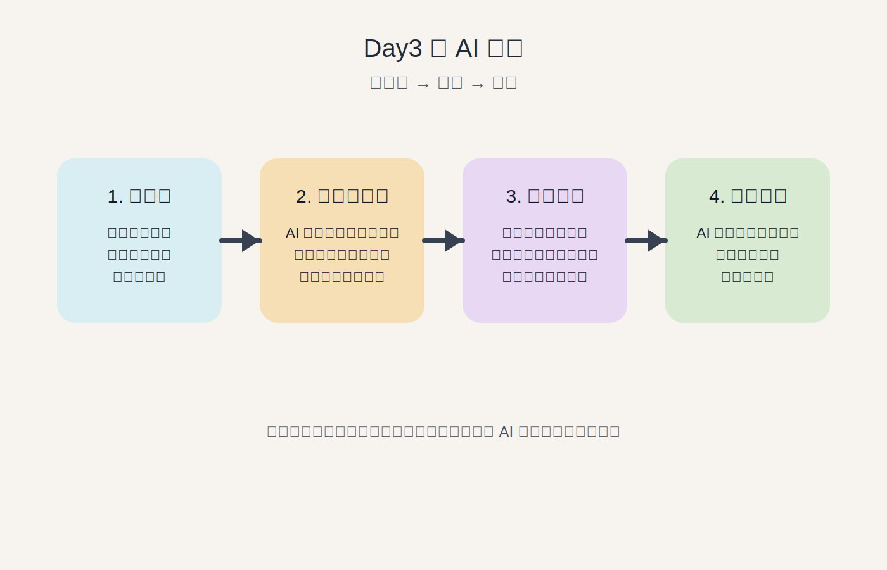
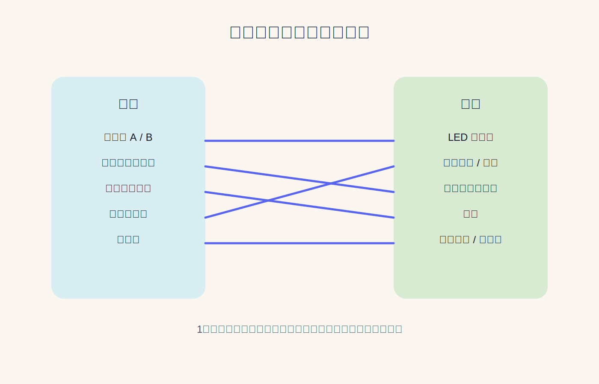
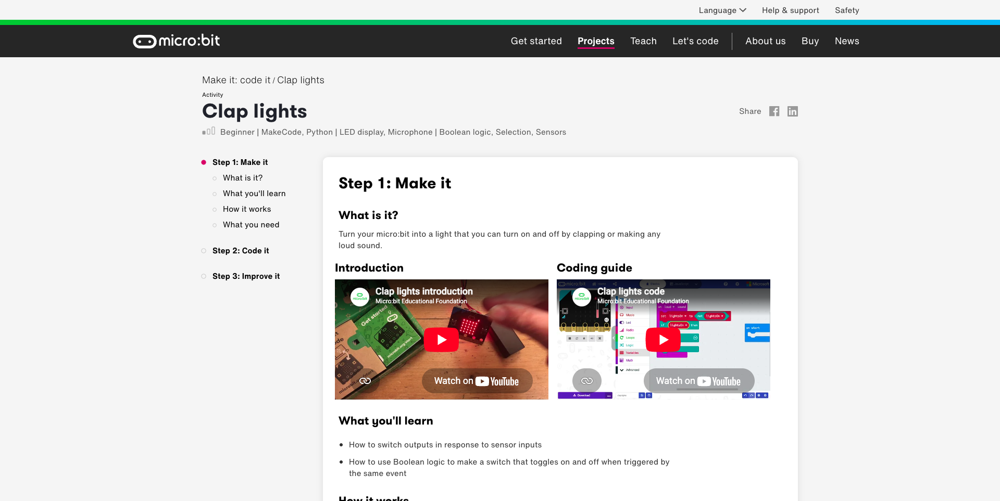
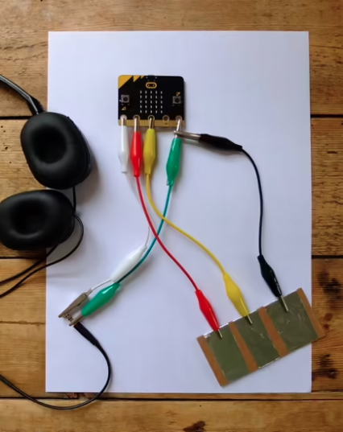

# Day3 フィジカルコンピューティング：応用・組み合わせ

---

## 今日やること

- Day2 の内容を復習する
- ブラウザと micro:bit をつなぐ仕組みを読み解く
- AI を使ってアイデアを深掘りする
- ミニ作品を作って発表する

---

## この日の位置づけ

- まず復習から入り、前回の内容を思い出す
- ブラウザ連携コードを AI と一緒に読み解く
- アイデアを言葉にしてから実装する
- 後半は個人でミニ作品を制作・発表する

---

## アイスブレイク

おすすめの京都の観光地はどこ？

---

## 最近のニュース

- Claude から Blender を操作
  https://x.com/claudeai/status/2049143438281445811
- AI が東大入試で首席・数学満点（日経新聞）
  https://www.nikkei.com/article/DGXZQOUC307OD0Q6A330C2000000/

---

## 復習：MakeCode でプログラミング

- ブロックと JavaScript は相互に切り替えられる
- 入力イベント：`on button A pressed` / `on shake` / `on tilt`
- 出力関数：`show leds` / `show icon` / `play tone`
- 条件分岐・ループ・変数

---

## 復習実習

前回作ったプログラムをもう一度作ってみよう

- AI を使って前回と同じプログラムを作る
- 入力・処理・出力を意識して説明してみる

---

## ブラウザと micro:bit の仕組みを深掘り

- VS Code をインストールしてコードを開く
- 前回の連携コードを AI と一緒に読む

|            | 役割                             |
| ---------- | -------------------------------- |
| HTML       | ページの中身・構造               |
| CSS        | 見た目・レイアウト               |
| JavaScript | 処理・通信（Serial / Bluetooth） |

---

## わからなくても大丈夫

- 完全に理解していなくても AI に指示できる
- わからないことを AI に聞きまくると理解が深まる
- 理解が深まると、より的確に AI に指示できるようになる

---

## AIとのやり取り

- Day2 は「こういうプログラムを作りたい」と AI に伝えてコードを作ってもらった
- Day3 は実装の前にアイデアを深掘りする
- いきなりコードを書かせるより、表現の方向を先に考える

---

## AIを「答える道具」から「問いかける相棒」へ

- **AIに質問してもらう**
  `自分が作りたいものをはっきりさせたいので、一つずつ質問してください` と頼む

- **最初の案で止まらない**
  `10通りの案` を出して比べる

- **自分の体験を入れる**
  経験や視点を伝えると、作品が自分らしくなる

<small>参考: Jeremy Utley, How to Master AI Powered Creativity in Just 13 Minutes https://www.youtube.com/watch?v=wv779vmyPVY</small>

---

## AIに「問わせる」

- AI を「答える道具」ではなく「問いかける相棒」として使う
- まず自分が作りたいものや体験を話す
- そのうえで、AI に一問ずつ質問させる
- 対話を通して、自分でも気づいていない作品の核を見つける

---

## 深掘りプロンプトの使い方

1. 作りたい体験を言葉にする
2. AI にアイデアを広げてもらう
3. 気に入った案を選ぶ
4. 最後に実装を頼む

---

## プロンプト例

- `micro:bit でできる面白いインタラクションのアイデアを10個出して`
- `加速度センサーと音を組み合わせて面白い表現を考えて`
- `このアイデアをもっと面白くするにはどうしたらいい？`
- `この案の実装に必要な入力と出力を整理して`
- `MakeCode JavaScript で最初の試作コードを書いて`

---

## プロンプト例 2

- `作品の方向性を考えたいので、まず私に一つずつ質問して`
- `自分が作りたいものをはっきりさせたいので、一つずつ質問して`
- `最初の案で止まりたくないので、10通りのバリエーションを出して`
- `私の経験や興味を活かせる方向に絞り込んで`

---

## AI活用の流れ

---

## 応用例

- 傾けると表情が変わるキャラクター（加速度→LED）
- 温度で音のテンポが変わる（温度→スピーカー）
- ボタンで音程が変わる簡易楽器（ボタン→スピーカー＋LED）
- 拡張機能でサーボ・OLED・NeoPixelなども使える

---

## ミニ作品制作：アイデア出し

- 作りたい体験を短く言葉にする
- AI にアイデアを深掘りさせる
- 気に入った案を1つ選んで以下をまとめる

1. 作品名
2. 使う入力と出力
3. 作ろうとした体験・コンセプト
4. AI とどう試行錯誤したか

条件: LED + スピーカー / テーマ自由

---

## ミニ作品の例

- 傾けると表情が変わるキャラクター
- 温度で音楽のテンポが変わる環境モニター
- ボタンで演奏できる楽器
- 振るとランダムなアイコンと音が出るおみくじ

Clap Lights:
https://microbit.org/projects/make-it-code-it/clap-lights/

---

## ミニ作品の例 2

Guitar 1 - touch tunes:
https://microbit.org/projects/make-it-code-it/guitar-1-touch-tunes/

---

## チュートリアルを試す

自分が選んだ機能のページを開いてサンプルを動かしてみよう

https://microbit.org/ja/get-started/features/overview/

- LED・ボタン / センサー / サウンド / 無線 など使う機能を選ぶ
- サンプルコードを MakeCode で動かして動作を確認する
- 自分の作品にどう活かせるかイメージする

---

## 休憩

---

## ミニ作品制作：実装・改善

- AI に実装を依頼してコードを生成してもらう
- MakeCode で動作確認する
- 動かしながら修正・改善する
- わからない箇所は AI に聞く

オプション: ブラウザと連携させる（Web Serial 推奨）
※ Web Bluetooth は混信しやすいため非推奨（チャレンジは歓迎）

---

## 発表・提出

- グループ内でデモし合う
- 代表者が全体発表する

発表・提出フォーマット:

1. 作品名
2. 使った入力と出力
3. 作ろうとした体験・コンセプト
4. AI とどう試行錯誤したか

---

## 提出物

- MakeCode 画面キャプチャを1〜2枚
- 実機またはシミュレーターの写真・キャプチャを1枚
- 上記フォーマットをテキストで提出

---

## センサー・出力デバイスの注意点

**電力**

- Bluetooth：省電力 / Wi-Fi：電気を食う / モーター：さらに大きい
- 電源が持つか事前に確認する

**通信**

- 無線は安定しないことがある
- 「送れたか」をユーザーが確認できる UI/UX の工夫を

**インターフェース・ライブラリ**

- デバイスを選ぶときはインターフェース（I2C・SPI・UART など）とライブラリの有無が重要
- ライブラリがあるデバイスは使いやすい
- ニッチなデバイスは自分でプロトコル実装が必要なことも
- 購入前に「対応ライブラリがあるか」を確認する

---

## 購入前に確認すること

- 電圧・電流・通信方式の互換性
- 感電リスク・発熱の有無
- 長期間安定して動くか

ハードウェアはお金がかかる。  
購入前に AI と会話して「これで動きそうか」のあたりをつけてから試す

---

## 作った話

ボタンを押すと自分と妻のスマートフォンに通知が飛ぶデバイスを作った

- 電池が3日ほどで切れてしまう
- 配線の引き回し・固定方法など「動かして終わり」ではない課題が残る
- 無線が安定しないケースがあり「送れたかどうか」の伝え方が必要

→ 動くものを作ってから、現実的な問題にぶつかる

---

## 他の選択肢

| プラットフォーム | 特徴                                                                             |
| ---------------- | -------------------------------------------------------------------------------- |
| Raspberry Pi     | Linux が動く小型コンピュータ。画面表示やネット接続、アプリ開発まで広く扱いやすい |
| M5Stack          | 画面・ケース・ボタンがまとまった開発しやすいデバイス。IoT や試作向き             |
| Arduino          | シンプルなマイコン。センサーやモーター制御など、電子工作の基本を学びやすい       |

micro:bit は最初の体験に向いていて、慣れてきたらこれらにも広げられる

---

## まとめ

- 入力と出力を組み合わせた
- AI を深掘りと実装の両方で使った
- 次回のアプリ開発にもつながる
