# Day4 アプリ開発：バイブコーディングの振り返り・コーディングエージェントと開発環境・データ

[TOC]

## この日の位置づけ

Day2・Day3 でフィジカルコンピューティング（センサー入力・出力・組み合わせ）を体験した。Day4 からはアプリ開発の領域に入る。担当も伊藤から小島に交代する。

1コマ目では、コーディングエージェントとは何かを整理したうえで種類・特徴を比較する。開発環境（VSCode / Git / Gemini CLI）のセットアップを確認し、Gemini CLI を使ったバイブコーディングを体験する。2年生で学んだバイブコーディングをコーディングエージェントの文脈で再整理し、シンプルな投票アプリを作る。VSCode から Git を操作してコードを管理する流れも習得する。

2コマ目では、「作ったアプリのデータがリロードで消える」という体験から始める。データの永続化とデータベースの必要性を理解し、SQLite でテーブルを操作したあと、Gemini CLI を使って Node.js のミニサーバーを作り、投票アプリと接続する。授業内に「リロードしてもデータが残る」状態を完成させる。

授業はハイブリッド形式で実施。リモート参加者もブラウザ上で同じ実習に取り組める。

## 到達目標

- コーディングエージェントの種類（ターミナル型・IDE統合型・ブラウザ型）を整理し、それぞれの特徴を説明できる
- VSCode・Git・Gemini CLI のセットアップができ、基本的な使い方を説明できる
- VSCode の Source Control パネルを使って git init → ステージング → コミット の基本フローを実施できる
- Git の変更を Discard Changes または git checkout で元に戻せる
- Gemini CLI に指示を出し、HTML/JS のシンプルなフロントエンドを作れる
- 「データがメモリにしか存在しない」状態と「データが永続化された」状態の違いを説明できる
- 構造化データと非構造化データの違いを説明できる
- AI によって非構造化データの扱い方と、アプリとの連携の選択肢が広がったことを説明できる
- SQLite でテーブルを作成し、INSERT・SELECT でデータを操作できる
- Gemini CLI を使って Node.js + SQLite のミニサーバーを生成・起動できる
- 投票アプリをサーバー経由で動かし、リロード後もデータが残ることを確認できる

---

## アジェンダ案

---

### 1コマ目（3時限目）

---

### 0. アイスブレイク・今日の概要・Day3 からの橋渡し【全体参加】

アイスブレイクのテーマ：「最近使ったアプリで一番お世話になっているものは？」

- 現地・リモートともに Slack に投稿する

今日の概要：

- Day2・Day3 でフィジカルの入出力を学んだ
- Day4・Day5 ではアプリ開発の発展を学ぶ
- Day4 の 1 コマ目：コーディングエージェントを整理して、ツールを整えて、投票アプリを作る
- Day4 の 2 コマ目：「消えた」から始まるデータとデータベースの話

---

### 1. 最近のニュース【講義】

AIコーディングツールに関する最新動向を5分で紹介する。

- （ニュース1）
- （ニュース2）

---

### 2. コーディングエージェントとは・種類の比較【講義】

#### コーディングエージェントとは

「AIにコードを生成させる」だけでなく、**ファイル操作・コマンド実行・修正まで一連の作業を任せる**のがコーディングエージェント。

Day2・Day3 で MakeCode の JavaScript を AI に生成させたのと同じ考え方の延長線上にある。あのとき手動でコピペしていた部分を、ローカルのファイルに直接書き込めるようにしたものがターミナル型のコーディングエージェント。

#### 主要ツールの分類（3カテゴリ）

| カテゴリ | 代表ツール | 特徴 | 今日使う？ |
| --- | --- | --- | --- |
| **ターミナル型** | Gemini CLI / Claude Code | ローカルファイルを直接操作。コマンドで指示を出す | ✅ Gemini CLI |
| **IDE統合型** | GitHub Copilot / Cursor | エディタに統合。補完とチャットが一体になっている | - |
| **ブラウザ型** | ChatGPT / Claude (Web) | ブラウザで汎用的に使える。コード生成・質問・説明 | - |

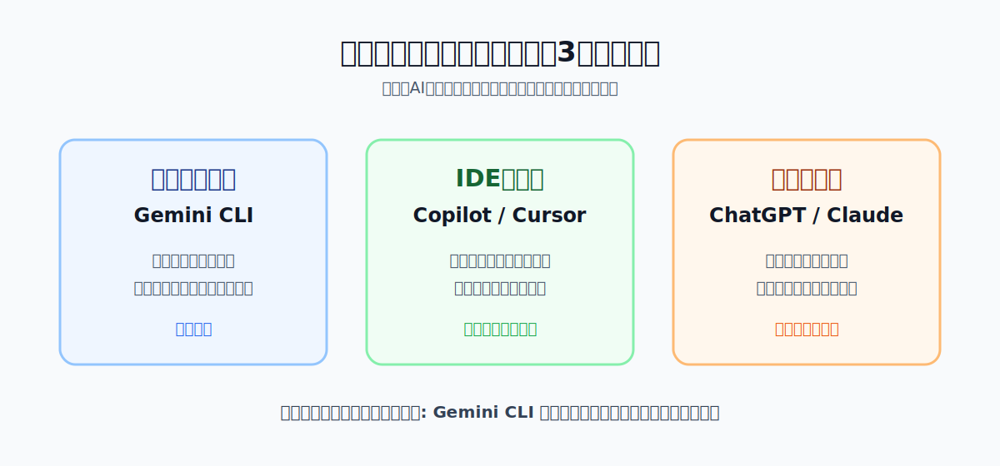

#### 今日 Gemini CLI を使う理由

- Google アカウントがあれば無料枠で使える
- ターミナルでコマンドを打つ操作に慣れる（Day5 のサーバー操作・Node.js 実行に直結する）
- ローカルのファイルを直接読み書きできる

#### どのツールを選ぶか

状況によって使い分ける。今後の授業・総合演習では、使い慣れたツールを自由に選んでよい。

- IDE統合型（Cursor など）を試したい人は、総合演習期間に試してみるとよい
- ブラウザ型（ChatGPT / Claude Web）は今まで通り並行して使ってよい

---

### 3. セットアップ確認【実習】

#### 確認する項目

**VSCode**
- https://code.visualstudio.com/ からインストール
- 起動できるか確認

**Git**
- Mac：ターミナルで `git --version` を実行（未インストールの場合は https://git-scm.com/ からインストール）
- Windows：https://git-scm.com/ から Git for Windows をインストール
- インストール後に `git --version` で確認

**Node.js**
- https://nodejs.org/ から LTS 版をインストール
- インストール後に `node --version` で確認
- Gemini CLI の実行に必要

**Gemini CLI**
- Node.js インストール後に以下を実行：
  ```
  npm install -g @google/gemini-cli
  ```
  ※ Mac で Homebrew を使っている場合は `brew install gemini-cli` でもよい
- Google アカウントでサインイン（初回起動時に認証画面が開く）
- インストール後に `gemini --version` で確認

**Gemini CLI Companion（VSCode 拡張機能）**
- VSCode の拡張機能マーケットプレイスで「Gemini CLI Companion」を検索してインストール
- これにより Gemini CLI が VSCode のワークスペース情報（開いているファイル・カーソル位置・選択範囲・差分）を受け取れるようになる
- 単に統合ターミナルで動かすだけでは渡らない情報が連携されるため、必ずセットで入れる

#### トラブルが起きたら

詰まったときは [セットアップトラブルシューティング](./setup_troubleshooting.md) を参照すること。
解決しない場合は Slack で質問する。

---

### 4. Gemini CLI 入門・VSCode との連携【講義＋実習】

Gemini CLI と VSCode を連携させて動かす。単にターミナルで動かすだけでなく、開いているファイル・カーソル位置・選択範囲・差分を VSCode 側で扱えることで実用性が上がる。

#### 推奨構成

```
VS Code
 ├─ Gemini CLI Companion 拡張機能
 └─ 統合ターミナル
      └─ gemini
```

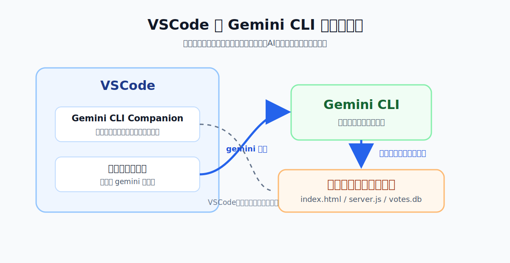

#### セットアップと接続確認

1. **VSCode でプロジェクトフォルダを開く**
   - `ファイル` → `フォルダーを開く` で作業フォルダを開く
   - Gemini CLI が操作するファイルと VSCode が表示するファイルが同じ場所になる

2. **統合ターミナルで Gemini CLI を起動する**
   - メニューバーから `表示` → `ターミナル` を選択して統合ターミナルを開く（ショートカット：`Ctrl + `` ` `` / Mac は `Cmd + `` ` `` `）
   - プロジェクトフォルダを開いた状態でターミナルを起動すると、そのフォルダがカレントになる
   - ターミナルで `gemini` を実行してインタラクティブモードを起動する

3. **IDE 連携を有効化する**
   - Gemini CLI 内で以下を順に実行する：
     ```
     /ide install
     /ide enable
     /ide status
     ```
   - `/ide install`：Companion 拡張機能をインストール（未導入の場合）
   - `/ide enable`：VSCode との連携を有効化
   - `/ide status`：接続状態と認識しているファイルを確認

#### 安全な使い方の型

最初からファイルを書き換えさせるのではなく、段階を踏む。

1. **調査・説明だけ頼む**：「このコードが何をしているか説明して」
2. **変更案を出させる（書き換えない）**：「〇〇を修正する案を出して。まだファイルは書き換えないで」
3. **問題なければ差分で変更を依頼する**：「差分で変更して」
4. **VSCode の差分ビューで確認して受け入れる**：変更内容をエディタで確認し、問題なければ受け入れる

この流れで「AI が書く → 自分が確認する → 受け入れる」の習慣をつける。

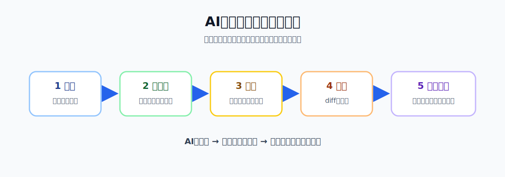

#### AIに指示を出すときのポイント

- 目的・制約・出力形式を明確に伝える
- うまくいかないときは「何が問題か」「どう直せばよいか」を AI 自身に聞く
- 生成・変更されたコードが何をしているかを必ず自分で確認する

---

### 5. Git in VSCode【講義＋実習】

バイブコーディングを始める前に、作ったコードを管理する方法を習得する。

#### なぜバージョン管理が必要か

- 「一つ前の状態に戻したい」「どこを変えたか記録したい」
- コードの「セーブポイント」としての役割
- AI が生成したコードをどんどん試せる安心感を作る

#### VSCode の Source Control パネルを使う

**手順**

1. **リポジトリを初期化する**
   - VSCode 左サイドバーの Source Control アイコン（枝分かれのようなアイコン）をクリック（ショートカット：`Ctrl + Shift + G` / Mac は `Cmd + Shift + G`）
   - 「Initialize Repository」をクリック
   - ※ターミナルで `git init` を実行しても同じ

2. **変更を確認する**
   - ファイルを追加・編集すると自動的に「Changes」に表示される
   - ファイル名の横の `M`（Modified）・`U`（Untracked）の意味を確認する

3. **ステージングする（`+` ボタン）**
   - コミットに含めたい変更を選んでステージに上げる
   - 「Stage All Changes」ですべてを一括ステージも可能

4. **コミットする（チェックマーク）**
   - メッセージ欄にコミットメッセージを入力する
   - 例：`最初のコミット`、`投票アプリを追加`
   - チェックマークをクリックしてコミット完了

5. **.gitignore を作る**
   - プロジェクトルートに `.gitignore` を作成する
   - Gemini CLI に「Node.js プロジェクト用の .gitignore を作って」と頼む
   - `node_modules/` や `votes.db` がリポジトリに含まれないことを確認する

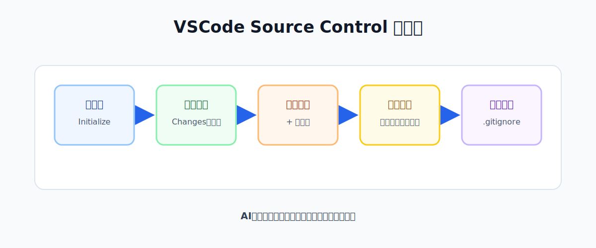

**コミットメッセージの書き方**

- 何をしたかを一言で書く
- 例：`投票アプリの初期実装`、`SQLite のテーブル定義を追加`
- 日本語でも英語でもよい

---

### 5.5. Git 演習：作って・コミットして・戻す【実習】

Git が「コードのセーブポイント」として機能することを、小さな練習用ページで体験する。投票アプリとは別のファイルを使うことで、失敗しても本番に影響しない。

#### Step 1：Gemini CLI で hello.html を作る

プロンプト例：

```
自己紹介ページを HTML/CSS で作って。
名前と好きなことを書いた1ページ。シンプルでいい。
```

ブラウザで開いて動作を確認する。

#### Step 2：コミットする

- VSCode Source Control でステージング → コミット
- コミットメッセージ例：`hello.html を作成`
- ターミナルで `git log --oneline` を実行してコミットが残ったことを確認する

#### Step 3：Gemini CLI で変更を加える

プロンプト例：

```
hello.html の背景色を変えて、新しい段落を1つ追加して
```

- VSCode の diff ビュー（Source Control → ファイル名をクリック）で変更前後を確認する
- 「どこが変わったか」が視覚的に見えることを確認する

#### Step 4：元に戻す

**方法 A（VSCode GUI）**：

- Source Control の Changes に表示された `hello.html` を右クリック
- 「Discard Changes」を選択
- ファイルがコミット直後の状態に戻ることを確認する

**方法 B（Gemini CLI に依頼）**：

Gemini CLI に以下のように依頼する：

```
hello.html の変更を元に戻して。git のコマンドを実行して。
```

- Gemini CLI がコマンドを提案・実行し、方法 A と同じ結果になることを確認する

#### 確認ポイント

- 「AI が何かを壊しても、Git があればすぐ戻せる」
- diff ビューで変更内容が見える = 何が起きているかわかる
- この hello.html は演習専用。次の投票アプリとは別ファイル

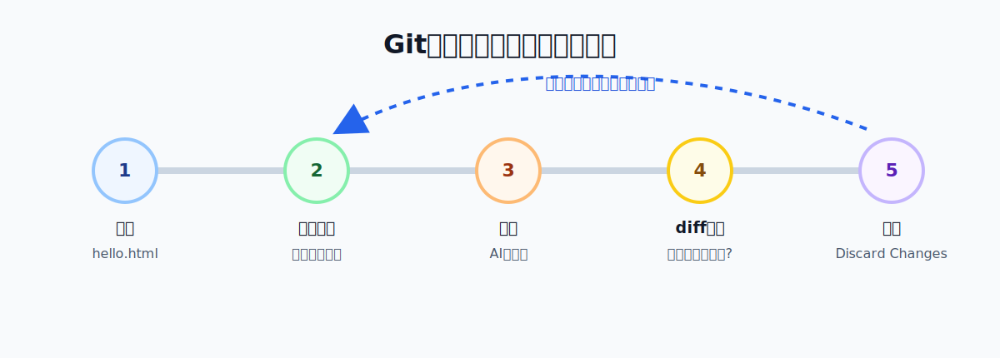

---

### 6. バイブコーディング：投票アプリを作る【実習】

Gemini CLI に指示して、シンプルな投票アプリ（HTML/CSS/JS）を作る。

#### アプリの仕様

- 質問と選択肢（例：「今日のランチは何を食べたい？」/ ラーメン・寿司・カレー・サラダ）
- 各選択肢にボタンがあり、クリックするとカウントアップ
- 現在の集計結果をリアルタイムに表示
- フレームワークは使わず、純粋な HTML / CSS / JS で作る

#### Gemini CLI への最初のプロンプト例

```
シンプルな投票アプリを HTML/CSS/JS で作って。
機能：
- 質問：「今日のランチは何を食べたい？」
- 選択肢：ラーメン / 寿司 / カレー / サラダ
- 各選択肢にボタンがあり、クリックするとカウントアップ
- 現在の集計結果を表示する
フレームワークは使わず、1つの HTML ファイルにまとめて。
```

#### 制作フロー

1. Gemini CLI にプロンプトを投げてコードを生成させる
2. VSCode でコードを開き、ブラウザで動作確認する
3. 気に入らない部分を Gemini CLI に修正させる
4. 動いたら VSCode の Source Control からステージング → コミットする

#### この時点での成果物

- ブラウザで動く投票アプリ（`index.html`）
- Git で管理されたプロジェクトフォルダ（コミット済み）

---

### 7. 「消えた」問題の確認【実習＋問いかけ】

全員でページをリロードして、カウントが 0 に戻ることを確認する。

問いかけ：

- 「データはどこに行った？」
- 「ブラウザを閉じたら、投票結果はどうなる？」
- 「複数人が別々のブラウザで投票したら、結果は合計されるか？」

確認できること：

- データは今、ブラウザのメモリ（JavaScript の変数）にしか存在しない
- リロードや閉じると消える
- 別のブラウザとは共有されない

「このデータを残すには、どこかに保存する必要がある」 → 2コマ目のテーマへ。

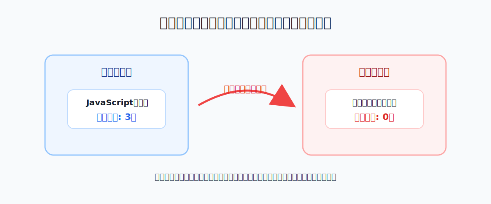

---

---

### 2コマ目（4時限目）

---

### 8. なぜデータが重要か【問いかけ＋講義】

**1 コマ目の答え合わせ**

以下を Slack に投稿してください：

```
1 コマ目の問いかけ 3 つ、答えを 1 行ずつ書いてください
① データはどこに行った？
② ブラウザを閉じたら投票結果はどうなる？
③ 複数人が別々のブラウザで投票したら、結果は合計されるか？
```

**身近なアプリのデータ**

以下を Slack に投稿してください：

```
SNS の投稿・EC カートの中身・LINE のトーク履歴、
どれが一番大量のデータを持っていると思う？理由も 1 行で。
```

**今日のゴール**

- 「永続化」＝データをどこかに書き込んで残すこと
- アプリにとってのデータ：ユーザーが入力したもの / アプリが計算したもの / 外から来るもの
- **今日 2 コマ目のゴール：投票アプリのデータを消えなくする**
  - SQLite にデータを保存する
  - Node.js サーバーをつなぐ
  - リロードしてもデータが残ることを確認する

---

### 9. データの種類：構造化データと非構造化データ【講義＋実習】

#### 構造化データ

整理された形式で保存されているデータ。

**実習：投票アプリのデータを構造化する**

Gemini CLI に以下を依頼する：

```
この投票アプリのデータを JSON 形式で表現して。
次に、同じデータをテーブル（表）形式で表現するとどうなるか教えて。
```

返ってきた JSON とテーブルを見比べる：

- JSON → キーと値の構造
- テーブル → 行と列。データベースはこの形式でデータを持つ

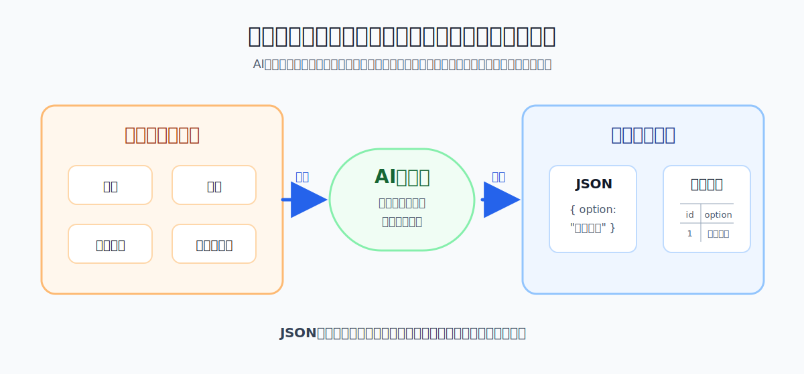

#### 非構造化データと AI

決まった形式を持たないデータ（画像・音声・自由記述テキスト・センサーストリーム）。

- 従来のアプリは「どの画像か」というパスしか扱えなかった
- AI に投げると「JSON で返ってくる」→ そのまま DB に保存・検索できる
- Day2・Day3 の micro:bit センサー値も非構造化データ。AI が「激しく動いている」などの状態に変換できる

※ 詳しくは Day6 以降で扱う。今日は「AI で変換できる」ということだけ押さえる。

---

### 10. SQLite とは・なぜサーバーが必要か【講義】

「JSON ファイルに保存すればいいのでは？」という問いから始める。

**JSON ファイル保存の限界**

Gemini CLI に以下を聞いてみる：

```
投票データが 100 万件入った JSON ファイルから、
ラーメンの票だけを取り出すコードを書いて。
```

返ってきたコードを見て「これを毎回やるのは大変」という直感を得る。
→ データベースならこれが 1 行の SQL で済む。

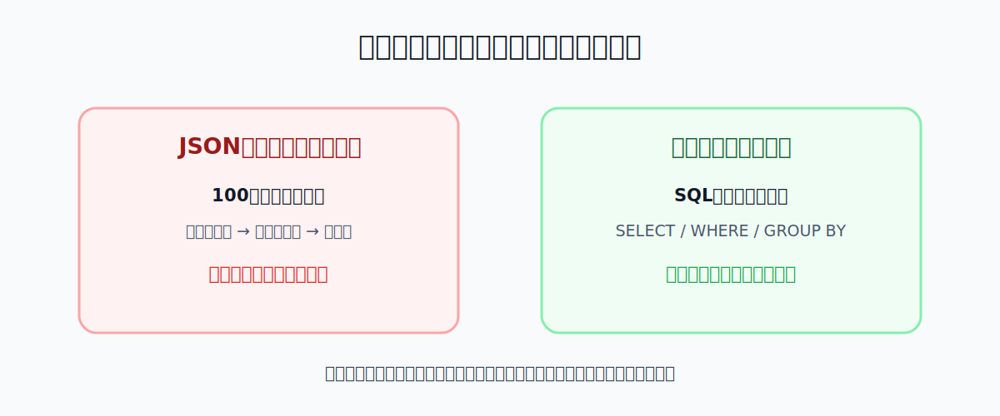

**SQLite の特徴**

- データベース全体が 1 つの `.db` ファイル
- サーバー不要・インストール不要（ブラウザ版で今日は確認する）
- `votes.db` というファイルが手元に残るので、実体が見えてわかりやすい
- Day5 では Node.js サーバーと組み合わせてブラウザから操作できるようにする

**なぜサーバーが必要か**

ブラウザは直接ローカルファイルを読み書きできない。そのため間に Node.js サーバーを置く必要がある。

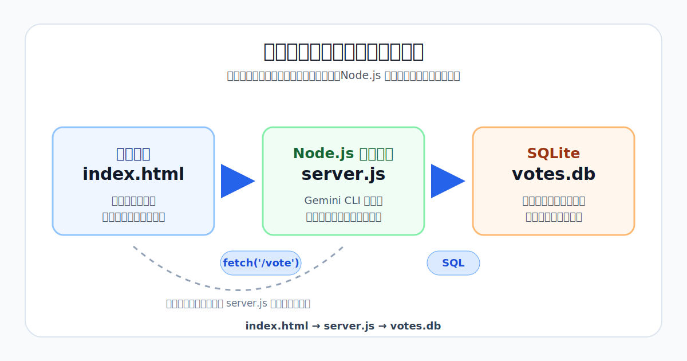

**server.js の最小構造（概要）**

今日 Gemini CLI が生成するファイルには以下が含まれる（コードを読む必要はない、役割だけ把握する）：

- `require(...)` → 必要なライブラリを読み込む
- `app.post('/vote', ...)` → 「投票する」リクエストを受け取る
- `app.get('/votes', ...)` → 「集計結果を返す」リクエストを受け取る
- `res.json(...)` → ブラウザに JSON を返す

---

### 11A. SQLite 実践（sqliteonline.com）【実習】

ブラウザで動く SQLite ツール（https://sqliteonline.com）を使い、投票アプリが使うテーブルを実際に作る。**この間 Gemini CLI は閉じておく。**

#### フェーズ 1：全員で一緒に実行する

**テーブル作成**：

```sql
CREATE TABLE votes (
  id INTEGER PRIMARY KEY AUTOINCREMENT,
  option TEXT NOT NULL,
  voted_at DATETIME DEFAULT CURRENT_TIMESTAMP
);
```

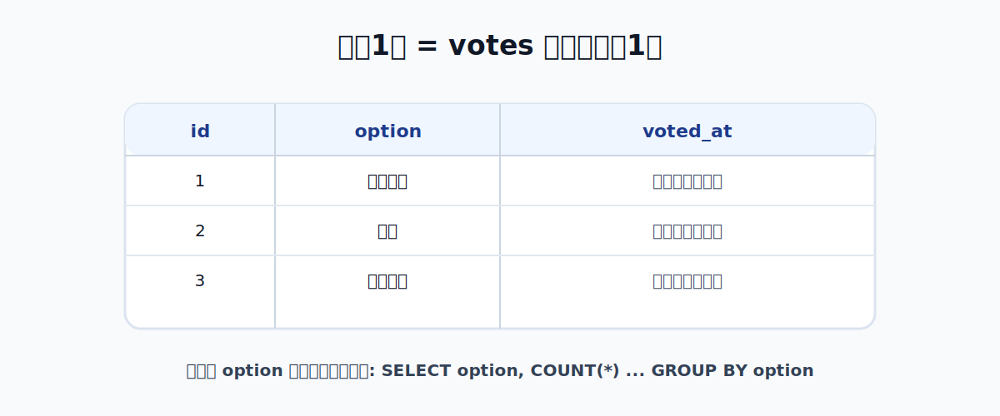

**データ挿入**：

```sql
INSERT INTO votes (option) VALUES ('ラーメン');
INSERT INTO votes (option) VALUES ('寿司');
INSERT INTO votes (option) VALUES ('ラーメン');
INSERT INTO votes (option) VALUES ('カレー');
INSERT INTO votes (option) VALUES ('ラーメン');
```

**集計クエリ**：

```sql
SELECT option, COUNT(*) AS count
FROM votes
GROUP BY option
ORDER BY count DESC;
```

確認ポイント：

- テーブルの構造（スキーマ）と、1 コマ目の投票アプリのデータが対応していることを確認する
- SQL の各キーワード（SELECT / FROM / WHERE / GROUP BY）が何をしているか説明できるようにする

#### フェーズ 2：Gemini CLI でさらに試す

sqliteonline.com を開いたまま、ターミナルで Gemini CLI を起動する。

依頼例：

```
直近 5 件の投票を新しい順に取得する SQL を書いて。
votes テーブルのカラムは id, option, voted_at。
```

Gemini CLI が返した SQL を sqliteonline.com に貼って実行する。「Gemini が書いた SQL がそのまま動く」ことを確認する。

---

### 11B. Gemini CLI でミニサーバーを作る【実習】

**ゴール：** `node server.js` を実行 → ブラウザで投票 → リロードしてもデータが残る

#### ステップ 1：パッケージのインストール

投票アプリのフォルダで以下を実行する：

```bash
npm init -y
npm install express better-sqlite3
```

#### ステップ 2：Gemini CLI でサーバーを生成する（5分）

Gemini CLI に以下を依頼する：

```
Node.js と Express と better-sqlite3 を使って、
投票アプリのバックエンドを作って。
- POST /vote でオプション名を受け取って votes.db に保存する
- GET /votes でオプションごとの集計（option と count）を JSON で返す
- index.html を静的ファイルとして配信する
サーバーは localhost:3000 で起動する。
コードはできるだけシンプルに。
```

生成された `server.js` を VSCode で確認する。役割だけ把握できれば OK：

- `require(...)` → ライブラリを読み込む
- `app.post('/vote', ...)` → 投票を受け取って DB に保存する
- `app.get('/votes', ...)` → 集計結果を JSON で返す
- `app.listen(3000, ...)` → ポート 3000 でサーバーを起動する

#### ステップ 3：index.html を修正する（10分）

Gemini CLI に以下を依頼する：

```
index.html のボタンクリック時に POST /vote を fetch で呼び出して。
ページ読み込み時に GET /votes を呼び出して集計結果を表示して。
```

#### ステップ 4：動作確認（10分）

```bash
node server.js
```

ブラウザで `http://localhost:3000` を開く。

確認手順：
1. 投票ボタンをクリックする
2. ページをリロードする
3. 集計結果がリロード後も残っていることを確認する
4. VSCode のファイルツリーに `votes.db` が生成されていることを確認する

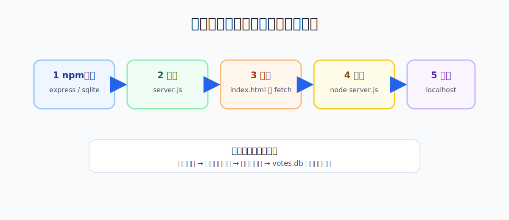

**詰まったときの対処：**

- `better-sqlite3` がインストールできない → Gemini CLI に「better-sqlite3 の代わりに sqlite3 パッケージを使って同じコードを書き直して」と依頼する
- ポートが使用中のエラー → `3000` を `3001` に変えて再起動する
- fetch がエラーになる → server.js に `express.static('.')` が含まれているか確認する

#### .gitignore の確認

```
node_modules/
votes.db
```

の 2 行が `.gitignore` に含まれていることを確認する。含まれていなければ Gemini CLI に「.gitignore に node_modules と votes.db を追加して」と依頼する。

---

### 12. まとめ・Day5 予告【講義】

**自己チェック（2分）**

以下の項目を「できる / 怪しい / まだわからない」で Slack に投稿する：

```
① コーディングエージェントの種類（ターミナル型・IDE統合型・ブラウザ型）を説明できる
② Gemini CLI で HTML/JS のアプリを作れる
③ Git でコミットできる
④ データがメモリにしかない状態と永続化の違いを説明できる
⑤ 構造化データと非構造化データの違いを説明できる
⑥ SQLite でテーブルを作り INSERT・SELECT を実行できる
⑦ node server.js を起動して投票アプリが動いた
```

「怪しい」「まだわからない」が多かった項目は Day5 の冒頭でフォローする。

**Day5 の予告（3分）**

今日の成果：

```
ブラウザ（index.html）
    ↓ fetch('/vote')
server.js（Gemini CLI で生成）
    ↓ SQL
votes.db（SQLite）
```

Day5 でやること：

- 今日 Gemini CLI が生成した server.js の構造を整理する
- Express のルーティング・エラー処理を理解する
- API として公開できる形に整える

**締め（1分）**

```
今日詰まったポイント・疑問を Slack に 1 行書いてください。
（Day5 の冒頭で取り上げます）
```

---

## 授業内の進行例

### 1コマ目（3限・13:40〜15:20）

| 時間 | 時刻 | 内容 | 種別 | リモート対応 |
| --- | --- | --- | --- | --- |
| 0〜10分 | 13:40〜13:50 | アイスブレイク・今日の概要・Day3 からの橋渡し | 全体参加 | Slack 参加 |
| 10〜15分 | 13:50〜13:55 | 最近のニュース | 講義 | 視聴・チャット |
| 15〜30分 | 13:55〜14:10 | コーディングエージェントとは・種類の比較 | 講義 | 視聴・チャット |
| 30〜45分 | 14:10〜14:25 | セットアップ確認（VSCode / Git / Gemini CLI） | 実習 | 同様に実施・詰まったら Slack で質問 |
| 45〜55分 | 14:25〜14:35 | Gemini CLI 入門：基本操作を一緒に試す | 講義＋実習 | 視聴・同様に実施 |
| 55〜65分 | 14:35〜14:45 | Git in VSCode：init → ステージング → コミット | 講義＋実習 | 同様に実施 |
| 65〜80分 | 14:45〜15:00 | **Git 演習：hello.html → コミット → 変更 → 元に戻す** | 実習 | 同様に実施 |
| 80〜95分 | 15:00〜15:15 | バイブコーディング：投票アプリ（HTML/JS）を作る | 実習 | 同様に実施 |
| 95〜100分 | 15:15〜15:20 | 「消えた」問題の確認・問いかけ | 実習＋問いかけ | 視聴・Slack 参加 |

### 2コマ目（4限・15:40〜17:20）

| 時間 | 時刻 | 内容 | 種別 | リモート対応 |
| --- | --- | --- | --- | --- |
| 0〜15分 | 15:40〜15:55 | なぜデータが重要か（Slack 問いかけ＋今日のゴール提示） | 問いかけ＋講義 | Slack 参加 |
| 15〜30分 | 15:55〜16:10 | データの種類（構造化データ体験・非構造化データ概要） | 講義＋実習 | 同様に実施 |
| 30〜40分 | 16:10〜16:20 | SQLite とは・なぜサーバーが必要か（構成図・server.js 概要） | 講義 | 視聴・チャット |
| 40〜60分 | 16:20〜16:40 | SQLite 実践（sqliteonline.com）：テーブル作成・INSERT・SELECT | 実習 | ブラウザで同様に実施 |
| 60〜90分 | 16:40〜17:10 | Gemini CLI でミニサーバーを作る・投票アプリと接続・動作確認 | 実習 | 同様に実施 |
| 90〜100分 | 17:10〜17:20 | 自己チェック・Day5 予告・詰まりポイント投稿 | 問いかけ＋講義 | Slack 参加 |

---

## 事前学習

以下のソフトウェアをインストールしてくること。（2時間程度）

1. **VSCode**：https://code.visualstudio.com/
2. **Git**：https://git-scm.com/
3. **Node.js**（LTS 版）：https://nodejs.org/
4. **Gemini CLI**：Node.js インストール後にターミナルで `npm install -g @google/gemini-cli` を実行し、Google アカウントでサインインする

インストール後に以下のコマンドで動作確認する：

```
git --version
node --version
gemini --version
```

3つとも version が表示されれば OK。エラーが出た場合は [セットアップトラブルシューティング](./setup_troubleshooting.md) を参照するか、Slack で質問すること。

## 事後学習

Day4 で作った投票アプリと SQLite の関係を整理し、Day5 に向けて以下を考える。（2時間程度）

- 今日作った `index.html` のコードを見直し、どこでカウントを管理しているかを確認する
- 投票アプリのデータが SQLite のどのカラムに対応するかを整理する
- 「バックエンドとは何か」を調べ、Node.js / Express の役割をまとめる

Gemini CLI への質問例：

```
Node.js と Express を使ってシンプルな API サーバーを作るとはどういうことか、
初心者向けに説明して。バックエンドとフロントエンドの関係も含めて。
```

## 成果物の例

- Git 演習の hello.html と diff のスクリーンショット（変更前後）
- 投票アプリ（`index.html`）と Git リポジトリ（コミット済み）
- sqliteonline.com でのテーブル作成・集計クエリの画面キャプチャ
- Gemini CLI が生成した `server.js`
- `node server.js` を起動し、リロード後もデータが残っている投票アプリの画面キャプチャ
- `votes.db` がプロジェクトフォルダに生成されていることの確認（VSCode のファイルツリーのキャプチャ）
- Gemini CLI に投げたプロンプトの記録

## 備考

- 授業はハイブリッド形式（現地＋リモート）で実施
- SQLite の実習は https://sqliteonline.com を使用（インストール不要・Windows / Mac 共通）
- 投票アプリのテーマ（質問と選択肢）は授業内で自由に決めてよい
- フレームワークなしの HTML / CSS / JS で作る
- Gemini CLI は Google アカウントがあれば無料枠で使用できる（事前にサインインを済ませておくこと）
