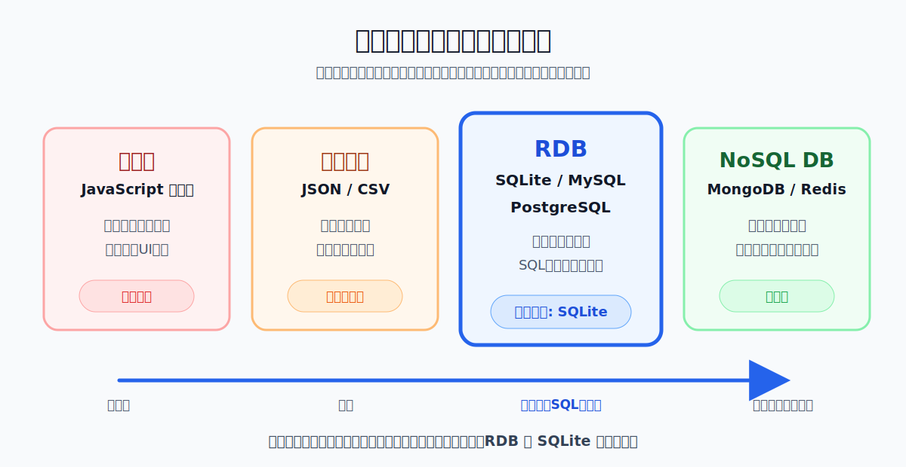
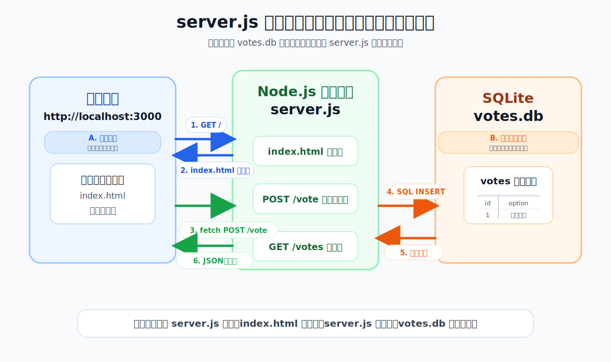

# Day4 アプリ開発発展①
## バイブコーディングの振り返り・コーディングエージェント・データ


---

## 今日やること（1コマ目）

- コーディングエージェントの種類を整理する
- VSCode・Git・Gemini CLI を使えるようにする
- Gemini CLI でバイブコーディングを体験する
- Git でコードを管理する（コミット・元に戻す）
- 投票アプリを作る

---

## 今日やること（2コマ目）

- 「消えた」問題から、データ保存の必要性を考える
- 構造化データと非構造化データを整理する
- SQLite でテーブルを操作する
- Gemini CLI でミニサーバーを作る
- 投票アプリとサーバーをつないで、リロードしてもデータが残るようにする

---

## この日の位置づけ

- Day2・Day3：micro:bit でフィジカルコンピューティングを体験した
- Day4・Day5：アプリ開発の領域に入る
- 担当も伊藤から小島に交代する
- コーディングエージェントを整理し、ツールを整えて、投票アプリを作る
- 「消えた」から始まるデータとデータベースの話

---

## アイスブレイク

最近使ったアプリで一番お世話になっているものは？

Slack に投稿してください

---

## 最近のニュース ①
### AI の性能がさらに向上：「考えてから生成する」時代へ

- **GPT-5.5（4月23日）**：発表資料で「vibe coding」を公式に使用。コードを書く・デバッグする・完結させる能力が向上　[→ OpenAI](https://openai.com/index/introducing-gpt-5-5/)

- **Claude Opus 4.7（4月16日）**：コーディング性能が前バージョンから大幅に向上。長時間・複雑なエージェントタスクに対応　[→ GitLab Blog](https://about.gitlab.com/blog/claude-opus-4-7-is-now-available-in-gitlab-duo-agent-platform/)

- **GPT Image 2.0（4月21日）**：画像生成モデルが初めて「考えてから描く（Thinking）」機能を搭載。日本語テキストの描写も劇的に向上　[→ OpenAI](https://openai.com/index/introducing-chatgpt-images-2-0/)

---

## 最近のニュース ②
### 学生向け無料プランの動向

- **GitHub Copilot 学生プランが新規登録を一時停止（4月20日）**
  - コーディングエージェントの普及でインフラコストが急増し、新規の学生登録を停止
  [→ GitHub Blog](https://github.blog/jp/2026-04-21-changes-to-github-copilot-individual-plans/)

- 企業によっては学生に**無料**でコーディングツールを提供している
- ただし AI の計算コストの急増により、**内容は変わる可能性がある**
- 今日使う **Gemini CLI は Google アカウントがあれば無料枠で利用可能**

---

## コーディングエージェントとは

「AI にコードを生成させる」だけでなく、  
**ファイル操作・コマンド実行・修正まで一連の作業を任せる**のがコーディングエージェント

Day2・Day3 で MakeCode の JavaScript を AI に生成させた延長線上にある

あのとき手動でコピペしていた部分を、ローカルのファイルに直接書き込めるようにしたものが**ターミナル型のコーディングエージェント**

---

## 主要ツールの分類（3カテゴリ）

| カテゴリ | 代表ツール | 特徴 | 今日使う？ |
| --- | --- | --- | --- |
| **ターミナル型** | Gemini CLI / Claude Code | ローカルファイルを直接操作。コマンドで指示を出す | ✅ Gemini CLI |
| **IDE 統合型** | GitHub Copilot / Cursor | エディタに統合。補完とチャットが一体になっている | - |
| **ブラウザ型** | ChatGPT / Claude (Web) | ブラウザで汎用的に使える。コード生成・質問・説明 | - |


---

## 今日 Gemini CLI を使う理由

状況によって使い分ける。今後の授業・総合演習では、使い慣れたツールを自由に選んでよい

- Google アカウントがあれば**無料枠で使える**
- ターミナルでコマンドを打つ操作に慣れる（Day5 のサーバー操作・Node.js 実行に直結）
- ローカルのファイルを**直接読み書きできる**

---

## セットアップ確認

| ツール | 確認コマンド | 入手先 |
| --- | --- | --- |
| VSCode | 起動できるか | https://code.visualstudio.com/ |
| Git | `git --version` | https://git-scm.com/ |
| Node.js | `node --version` | https://nodejs.org/ |
| Gemini CLI | `gemini --version` | `npm install -g @google/gemini-cli` |

3つとも version が表示されれば OK

---

## Gemini CLI の推奨構成

```
VS Code
 ├─ Gemini CLI Companion 拡張機能
 └─ 統合ターミナル → gemini
```

- `表示` → `ターミナル` で統合ターミナルを開く
- `gemini` でインタラクティブモードを起動
- `/ide install` → `/ide enable` → `/ide status` で連携確認


---

## AI への安全な指示の出し方

最初からファイルを書き換えさせるのではなく、段階を踏む

1. **調査・説明だけ頼む**：「このコードが何をしているか説明して」
2. **変更案を出させる（書き換えない）**：「まだファイルは書き換えないで」
3. **差分で変更を依頼する**：「差分で変更して」
4. **VSCode の diff ビューで確認して受け入れる**


---

## Git in VSCode：なぜ必要か

- 「一つ前の状態に戻したい」
- 「どこを変えたか記録したい」
- コードの**セーブポイント**としての役割
- **AI が生成したコードをどんどん試せる安心感**を作る

---

## Git の基本フロー

1. **Initialize Repository**：Source Control パネルでリポジトリを初期化
2. **`.git` フォルダを確認**：ターミナルで `ls -la`（Mac）/ `dir /a /b`（Windows）
3. **変更を確認**：`M`（Modified）/ `U`（Untracked）
4. **ステージングする**：`+` ボタンで変更を選択
5. **コミットする**：メッセージを入力してチェックマークをクリック


---

## `.git` フォルダとは

- Git がコミット履歴・設定・ブランチ情報をすべて保存している場所
- このフォルダがある = このフォルダは Git リポジトリ
- **中のファイルは直接編集しない**
- 隠しフォルダのため通常は非表示

**VSCode で表示する方法**：
`設定`（Cmd+,）→ `files.exclude` を検索 → `**/.git` を削除

---

## Git 演習：作って・コミットして・戻す

- **Step 1**：Gemini CLI で `hello.html`（自己紹介ページ）を作る
- **Step 2**：Source Control でステージング → コミット
- **Step 3**：Gemini CLI で変更を加える → diff ビューで確認
- **Step 4**：元に戻す — GUI: `Discard Changes` / Gemini CLI: 「変更を元に戻して」


---

## バイブコーディング：投票アプリを作る

**仕様**：
- 質問：「今日のランチは何を食べたい？」
- 選択肢：ラーメン / 寿司 / カレー / サラダ
- 各選択肢にボタン → クリックでカウントアップ
- 集計結果をリアルタイム表示
- フレームワークなし、1 つの HTML ファイルにまとめる

---

## Gemini CLI への最初のプロンプト

```
シンプルな投票アプリを HTML/CSS/JS で作って。
機能：
- 質問：「今日のランチは何を食べたい？」
- 選択肢：ラーメン / 寿司 / カレー / サラダ
- 各選択肢にボタンがあり、クリックするとカウントアップ
- 現在の集計結果を表示する
フレームワークは使わず、1つの HTML ファイルにまとめて。
```

動いたら Source Control → ステージング → コミット

---

## 「消えた」問題

全員でページをリロードしてみよう

- データはどこに行った？
- ブラウザを閉じたら、投票結果はどうなる？
- 複数人が別々のブラウザで投票したら、結果は合計されるか？


---

# 休憩

---

## 「消えた」問題の答え合わせ

Slack に投稿してください：

```
① データはどこに行った？
② ブラウザを閉じたら投票結果はどうなる？
③ 複数人が別々のブラウザで投票したら、結果は合計されるか？
```

**今日 2 コマ目のゴール：投票アプリのデータを消えなくする**
- SQLite にデータを保存する
- Node.js サーバーをつなぐ
- リロードしてもデータが残ることを確認する

---

## 構造化データと非構造化データ

**構造化データ**：整理された形式で保存されているデータ
- JSON・テーブル（行と列）・データベース

**非構造化データ**：決まった形式を持たないデータ
- 画像・音声・自由記述テキスト・センサーストリーム


---

## AI による変化

- 従来は「どの画像か」というパスしか扱えなかった
- AI に投げると「JSON で返ってくる」→ そのまま DB に保存・検索できる
- Day2・Day3 の micro:bit センサー値も非構造化データ
- AI が「激しく動いている」などの状態に変換できる

---

## 構造化データをどこに持つか



1 コマ目の投票アプリは「メモリ」→ 今日は **RDB** で永続化する

---

## JSON ファイルに保存すると何が困るか


---

## RDB と SQLite

**RDB（リレーショナルデータベース）とは**：
- データを「テーブル（表）」で管理し、SQL という言語で操作する
- 代表例：MySQL・PostgreSQL・**SQLite**

**SQLite は RDB の一種**：
- データベース全体が **1 つの `.db` ファイル**
- サーバー不要・インストール不要
- `votes.db` がファイルとして手元に残る → 実体が見える

---

## なぜサーバーが必要か

ブラウザは直接ローカルファイルを読み書きできない  
間に **Node.js サーバー** を置く必要がある


---

## SQLite 実践（11A）

`11.0-A` フォルダで `sqlite3 votes.db` を起動して実行する

```sql
CREATE TABLE votes (
  id INTEGER PRIMARY KEY AUTOINCREMENT,
  option TEXT NOT NULL,
  voted_at DATETIME DEFAULT CURRENT_TIMESTAMP
);
```


---

## SQLite 実践：INSERT と SELECT

```sql
INSERT INTO votes (option) VALUES ('ラーメン');
INSERT INTO votes (option) VALUES ('寿司');
INSERT INTO votes (option) VALUES ('ラーメン');
```

```sql
SELECT option, COUNT(*) AS count
FROM votes
GROUP BY option
ORDER BY count DESC;
```

VSCode 拡張機能「**SQLite Viewer**」で `votes.db` を開くと GUI で確認できる

---

## Gemini CLI でミニサーバーを作る（11B）

**ゴール**：`node server.js` → ブラウザで投票 → リロードしてもデータが残る

1. Gemini CLI で `11.0-B` フォルダを作成
2. `npm init -y` → `npm install express better-sqlite3`
3. Gemini CLI で `server.js` を生成
4. `index.html` を fetch で接続するよう修正
5. `node server.js` で起動・動作確認


---

## 動作確認

<style scoped>
p, li { font-size: 0.9rem; line-height: 1.5; }
</style>

`node server.js` → ブラウザで `http://localhost:3000` を開く

1. 投票ボタンをクリックする
2. ページをリロードする
3. **集計結果がリロード後も残っていることを確認する**
4. VSCode のファイルツリーに `votes.db` が生成されていることを確認する



---

## 自己チェック

「できる / 怪しい / まだわからない」で Slack に投稿してください：

```
① コーディングエージェントの種類を説明できる
② Gemini CLI で HTML/JS のアプリを作れる
③ Git でコミットできる
④ データがメモリにしかない状態と永続化の違いを説明できる
⑤ 構造化データと非構造化データの違いを説明できる
⑥ SQLite でテーブルを作り INSERT・SELECT を実行できる
⑦ node server.js を起動して投票アプリが動いた
```

---

## Day5 の予告

今日の成果：


Day5 でやること：
- Gemini CLI が生成した `server.js` の構造を整理する
- Express のルーティング・エラー処理を理解する
- API として公開できる形に整える

---

## 締め

今日詰まったポイント・疑問を Slack に 1 行書いてください

（Day5 の冒頭で取り上げます）
