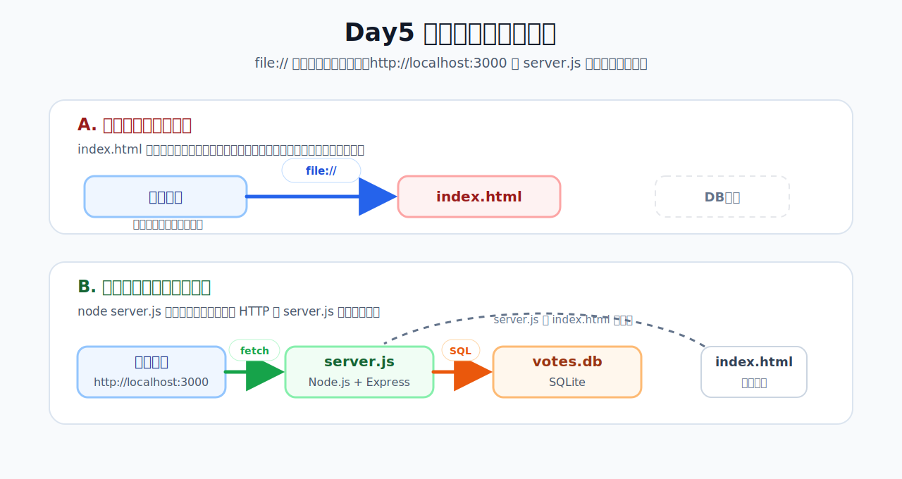
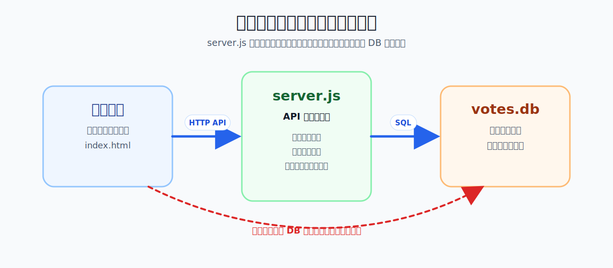
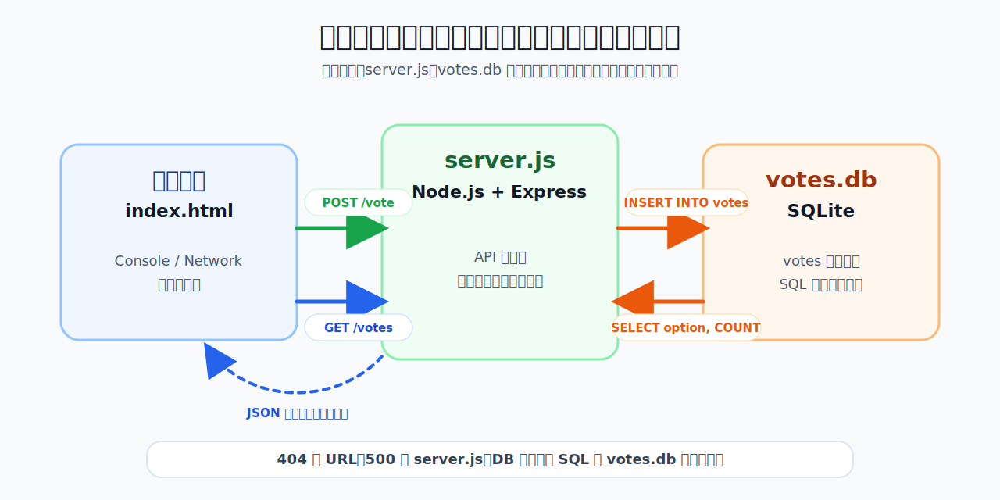
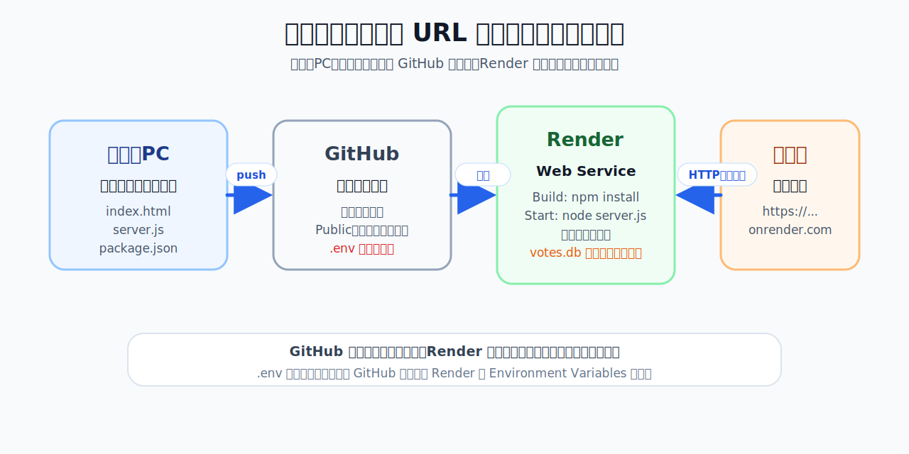
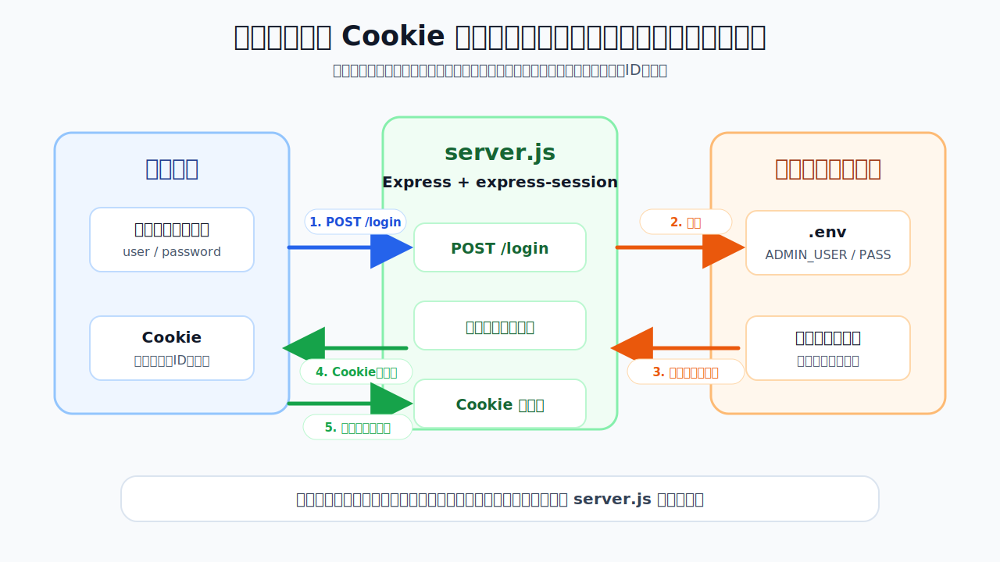
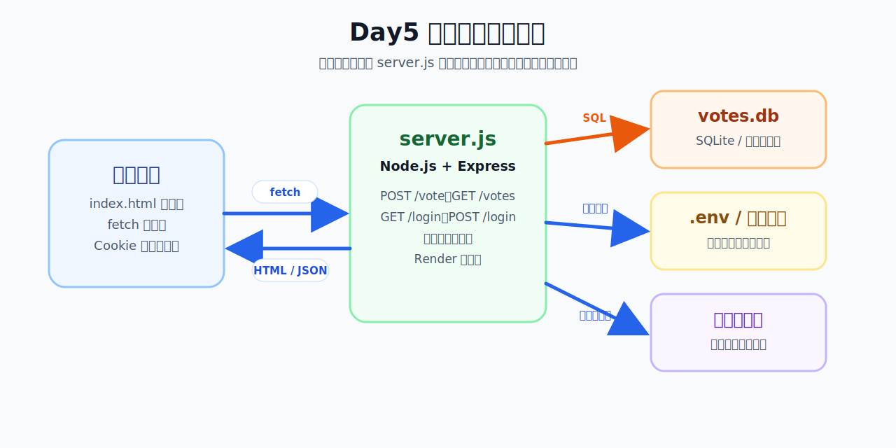

# Day5 アプリ開発発展②：Day4 の定着・デプロイ・認証とデバッグ

[TOC]

## この日の位置づけ

Day4 ではセットアップに時間がかかり、演習時間が十分に取れなかった。Day5 の 1 コマ目では、Git・Gemini CLI・アプリ開発（フロントエンド → バックエンド → データベース）の一連の流れをもう一度自分の手で体験することで、Day4 の理解を定着させる。特に「Gemini CLI と対話的に進める」という使い方がまだ身についていないため、その練習を重点的に行う。

2 コマ目では「作ったアプリを外に公開する」という体験（デプロイ）から始まる。GitHub へのプッシュと Render へのデプロイを通じて、自分だけが見られる `localhost:3000` を他の人も使える状態にする。公開後に「誰でも操作できる」問題に気づき、簡単なパスワード保護（認証）を追加するところまで進む。

授業はハイブリッド形式で実施。リモート参加者もブラウザ上で同じ実習に取り組める。

## 到達目標

- `.gitignore` に何を入れるべきかを理由とともに説明できる
- Gemini CLI に段階を踏んだ指示を出し、確認してから変更を加える流れを実践できる
- エラーが出たとき、Gemini CLI にエラーを貼り付けて原因を聞き、説明が理解できたら修正を依頼するという流れでデバッグを進めることができる
- `git remote add` と `git push` を使って GitHub にコードをプッシュできる
- Render にデプロイして外部からアクセスできる状態を作れる
- 保護のない API を公開することのリスクを説明できる
- Gemini CLI を使って特定のエンドポイントに簡単なパスワード保護を追加できる

---

## アジェンダ案

---

### 1コマ目（3時限目）

---

### 0. アイスブレイク・よくあった質問の解消【全体参加】

アイスブレイクのテーマ：「Day4 でいちばん詰まったところはどこ？」

- 現地・リモートともに Slack に投稿する
- 講師がよくあるものをピックアップして短く解説する

Day4 でよく上がった質問（事前に収集して回答する）：

- **`.gitignore` には何を入れればよいか**（このあとの講義で詳しく扱う）
- **server.js が動かない・エラーが出る**（このあとデバッグの方法を扱う）
- **Gemini CLI に何を言えばいいかわからなかった**（このあと対話型の使い方を扱う）

今日の概要：

- 1 コマ目：Day4 の流れをもう一度自分でやりきる（今度は自分のテーマで）
- 2 コマ目：作ったアプリを公開する → 認証が必要だと気づく → 追加する

---

### 1. Day4 の重要概念を整理【講義】

講師が画面を見せながら説明する。学生も手元で同じフォルダを開いて、コードを確認しながら聞く。

**Day4 で作成したフォルダを VSCode で開く**

🖱 **VSCode**

1. メニューバー「ファイル」→「フォルダを開く」
2. Day4 で作成した投票アプリのフォルダ（例：`app-dev-day4`）を選択して「開く」
3. エクスプローラーパネルに `index.html`・`server.js`・`votes.db` などが表示されることを確認する

> Day4 のフォルダが見つからない場合は、デスクトップや書類フォルダを確認する。それでも見当たらない場合は講師に声をかける。

---

#### フロントエンドだけの構成と、バックエンドを含む構成の違い

Day4 では途中から構成が変わった。その違いを改めて整理する。

**フロントエンドだけの構成（Day4 前半）**

下のコンポーネント図の **A. フロントエンドだけ** の構成にあたる。

- ブラウザの URL 欄：`file:///Users/自分の名前/.../index.html`
- サーバーは不要。ファイルをそのままブラウザが読む
- ボタンのクリックや画面の更新はできる
- **データはブラウザのメモリ（JS の変数）にしかない → リロードで消える**
- **別のブラウザやスマホからは見られない**

**バックエンドを含む構成（Day4 後半〜今日）**

下のコンポーネント図の **B. バックエンドを含む構成** にあたる。

- ブラウザの URL 欄：`http://localhost:3000`
- **`http://` で始まる** → HTTP という通信の仕組みでやりとりしている
- `localhost` = 自分のパソコン、`3000` = サーバーが待ち受けているポート番号
- ボタンをクリックすると、ブラウザが `server.js` にリクエストを送り、`server.js` が `votes.db` を読み書きする
- **データは `votes.db` ファイルに保存される → リロードしても残る**

**URL の違いが表すこと**

| | URL の見た目 | 意味 |
| --- | --- | --- |
| フロントエンドのみ | `file:///Users/...` | OS のファイルを直接ブラウザが開いている |
| バックエンドあり | `http://localhost:3000` | ローカルで動いているサーバーと HTTP 通信している |
| デプロイ後 | `https://my-app.onrender.com` | インターネット上のサーバーと HTTP 通信している |



`file://` のままでは fetch でサーバーにリクエストを送ることができない。`http://localhost:3000` を経由することで、初めてフロントエンドとバックエンドがつながる。

> **なぜ `file://` では fetch できないのか**：ブラウザのセキュリティ制限（同一オリジンポリシー）により、`file://` で開いたページから外部サーバーへのリクエストはブロックされる。`http://localhost:3000` 経由で開くと、同じオリジン（同じサーバー）からの通信になるため許可される。

---

#### サーバー・API・データベースとは何か（概念整理）

Day4 で作ったシステムの全体像は、上のコンポーネント図の **B. バックエンドを含む構成** にあたる。

| 層 | ファイル | 役割 |
| --- | --- | --- |
| フロントエンド | `index.html` | 画面の表示・ユーザーの操作を受け付ける |
| バックエンド | `server.js` | リクエストを受け取り、DB に問い合わせて結果を返す |
| データベース | `votes.db` | データを永続的に保存する |

各要素を改めて掘り下げる。

##### サーバーとは何か

「**常に起動していて、リクエストを受け取って返事を返すプログラム**」のこと。

身近なたとえ：

- レストランの厨房：注文（リクエスト）が入ったら料理（レスポンス）を作って返す
- カスタマーサポートの電話窓口：問い合わせを受け付けて回答する

「サーバー」という言葉には 2 つの意味があるので注意：

| 言葉 | 意味 |
| --- | --- |
| サーバー（機械） | 24 時間動いている物理的なコンピュータ |
| サーバー（プログラム） | その上で動く「リクエストを受けて返事を返す」プログラム |

Day4で作成した `server.js` は後者。Node.js というランタイム（JavaScript の実行環境）の上で動くサーバープログラム。

##### API とは何か・なぜ必要か

**API（Application Programming Interface）** ＝ プログラム同士がやりとりするための**インターフェース**（接点・窓口）。

インターフェースとは「外から見える使い方の形」のこと。内部の実装がどう動いているかを知らなくても、決まった形式で呼び出せば決まった結果が返ってくる、という仕組みを指す。

Web API の場合、「どの URL に・どんな方法（GET / POST など）で頼むと・どんな形式（JSON など）で返ってくるか」がインターフェースとして定義されている。

**今日作る投票アプリの API（メニュー表）：**

| エンドポイント | メソッド | 役割 | 返ってくるもの |
| --- | --- | --- | --- |
| `/votes` | GET | 集計結果を取得する | `[{ option, count }, ...]` の JSON |
| `/vote` | POST | 投票を 1 件登録する | `{ success: true }` |
| `/login` | POST | ログインする | リダイレクト |
| `/logout` | POST | ログアウトする | リダイレクト |

クライアント（ブラウザ）は「メニューに載っているもの」しか頼めない。サーバーはこのメニューを公開することでフロントエンドと連携する。

**なぜサーバー・API が必要なのか**

フロントエンド（ブラウザ）だけだと困ること：

| 問題 | 理由 |
| --- | --- |
| データを永続化できない | ブラウザのメモリは閉じれば消える。ローカルファイルへの直接書き込みはセキュリティ上禁止 |
| データを共有できない | 別の人のブラウザは別のメモリ。集計や共同編集ができない |
| 秘密情報を守れない | パスワードや API キーをフロントに置くと開発者ツールで誰でも見られる |
| 重い処理に向かない | ユーザーの端末性能に依存しない、安定した実行環境が必要 |

サーバー・API があれば：

- データを 1 か所に集めて永続化する
- 誰でも同じデータを参照できる
- 秘密情報をサーバー側だけに置ける
- 端末に関係なく同じ処理を実行できる

##### データベースとの関係：サーバーは「窓口・警備員」



**データベースを直接ブラウザに公開してはいけない理由：**

- 誰でも全テーブルを SELECT できる（個人情報も含めて）
- 誰でも DELETE / UPDATE で書き換えられる
- DB のパスワードがフロントエンドのコードから見えてしまう

そこでサーバーが「窓口」「警備員」の役割を果たす：

1. ブラウザからの依頼内容を確認する（例：投票内容のチェック）
2. 必要なデータだけ DB から取り出す（例：集計結果のみ）
3. 認証チェックや入力検証をする（例：管理者だけがリセットできる）
4. 整形して返す（例：JSON にして送る）

DB の前にサーバーを立てることで、初めて安全にデータを扱える。

> **覚えておきたい考え方**
> 「フロントエンドは誰でも見られる場所」「サーバーは自分のコードだけが知っている場所」
> パスワード・API キー・DB の中身に直接触れる処理は、すべてサーバー側に置く。

#### データベースを実際に見てみる【実習（10分）】

Day4 で作った投票アプリには `votes.db` というファイルがある。このファイルがデータベースの本体。今日は**中身を目で見て、データを直接追加する**ことで、「データベースとは何か」を体感する。

**SQLite Viewer をインストールする（まだ入れていない場合）**

🖱 **VSCode**

1. 左サイドバーの拡張機能アイコン（`⇧⌘X` / `Ctrl+Shift+X`）をクリック
2. 検索欄に `SQLite Viewer` と入力
3. 「SQLite Viewer」（作者：Florian Klampfer）をインストール

**Day4 のアプリを VSCode で開く**

🖱 **VSCode**

1. ファイル → フォルダを開く
2. Day4 で作成した投票アプリのフォルダ（例：`app-dev-day4`）を選択して開く

**votes.db の中身を確認する**

🖱 **VSCode**

1. エクスプローラーパネルで `votes.db` をクリック
2. SQLite Viewer が自動で開き、テーブル一覧が表示される
3. テーブル名（例：`votes`）をクリックして、保存されているデータを確認する

| 確認するポイント | 見るべき内容 |
| --- | --- |
| テーブル名 | `votes` など、どんな名前のテーブルがあるか |
| カラム名 | `id`・`option`・`created_at` など、どんな項目があるか |
| 行データ | 実際に投票された内容が行として並んでいる |

> SQL のテーブルは「表計算ソフトのシート」と同じ構造。列がカラム、行が1件のデータ。

**ブラウザで変化を確認する**

サーバーを起動してブラウザで集計を見ると、直接追加したデータが反映されていることを確認できる。

💬 **Gemini CLI**

```
サーバーを起動して。
```

ブラウザで `http://localhost:3000` を開き、投票結果の集計に追加した「ラーメン」が増えていることを確認する。

確認が終わったら、以下の通りサーバーを停止する。

💬 **Gemini CLI**

```
サーバーを停止して。
```

> **ここで掴んでほしいこと**
> SQL（`INSERT`・`SELECT`）はデータの「追加」「取得」を指示する言語。`server.js` の中でも同じ SQL が使われており、ブラウザからの操作はすべてこの SQL 命令に変換されてデータベースに届く。

**SQL を Gemini CLI で試してみる**

💬 **Gemini CLI**

まず全件取得してみる：

```
votes.db に接続して、votes テーブルの中身を全件表示して。
```

次に件数を確認する：

```
votes テーブルに何件のデータが入っているか数えて。
```

データを 1 件追加してみる：

```
votes テーブルに「ラーメン」という選択肢のデータを 1 件追加して。
```

追加後、SQLite Viewer の画面を更新（右上の更新ボタン）して、行が増えたことを目で確認する。

---

#### Git の流れを再確認する

| 操作 | VSCode での手順 | 実行されるコマンド（参考） |
| --- | --- | --- |
| **リポジトリを初期化する** | Source Control アイコン →「Initialize Repository」 | `git init` |
| **.gitignore を作成する** | Gemini CLI に依頼して生成（後述） | — |
| **変更を確認する** | Source Control パネルの「Changes」に変更ファイルが表示される | `git status` |
| **ステージングする** | Changes 欄のファイル横の `+` ボタン（または「Stage All Changes」） | `git add <ファイル名>` |
| **コミットする** | メッセージ欄に入力 → チェックマークボタン | `git commit -m "メッセージ"` |
| **繰り返す** | ファイルを編集 → ステージング → コミットを繰り返す | — |

#### `.gitignore` には何を入れるか

Git に含めるべきでないファイルの種類：

| 種類 | 例 | 理由 |
| --- | --- | --- |
| 生成物 | `node_modules/` | `npm install` で再生成できる。巨大なのでリポジトリに入れない |
| データファイル | `votes.db` | 実行時に生成される。テスト・本番でデータが混ざるのを防ぐ |
| 秘密情報 | `.env`（パスワード・API キーなど） | リポジトリが公開されると漏洩する |
| OS・エディタが作るファイル | `.DS_Store`（Mac）、`Thumbs.db`（Windows） | 開発には関係なく、他の人の環境で不要 |

Node.js プロジェクトの最低限の `.gitignore`：

```
node_modules/
votes.db
.env
.DS_Store
```

Gemini CLI への依頼例：

```
このプロジェクトに合った .gitignore を作って。
Node.js + Express + SQLite のプロジェクトです。
```

#### server.js を「流れ」で読む

コードを 1 行 1 行覚える必要はない。**「リクエストが来てから返事を返すまでの流れ」**をイメージできれば OK。

サーバーの動作を 2 つのフェーズに分けて見る：

**フェーズ A：起動時に 1 回だけやること**

サーバーを `node server.js` で立ち上げた瞬間に実行される処理。

1. ライブラリの読み込み（Express・better-sqlite3 など）
2. データベースに接続する（`votes.db` を開く）
3. テーブルがなければ作る（`CREATE TABLE IF NOT EXISTS`）
4. ポート 3000 で「待ち受け」を開始する（`app.listen(3000)`）

ここまで終わると、サーバーは「いつでもリクエストを受け付けられる状態」で待機する。

**フェーズ B：リクエストが来るたびに毎回やること**

ブラウザからリクエストが来るたびに、対応する処理が呼ばれる。



`server.js` の中では「どの URL にどのメソッドが来たら、どの処理を呼ぶか」のルールが宣言されている：

| ルール | 意味 |
| --- | --- |
| `app.get('/votes', ...)` | `GET /votes` が来たら集計結果を返す |
| `app.post('/vote', ...)` | `POST /vote` が来たら DB に保存する |
| `app.use(express.static('.'))` | URL に該当しないリクエストはファイル（`index.html` など）として返す |

#### コードの詳細は Gemini CLI に聞く

行ごとの詳細を覚える必要はない。わからない部分は Gemini CLI に説明してもらう。

```
server.js を読んで、リクエストが来てから返事を返すまでの流れを、
ステップごとに日本語で説明して。
初心者でもわかるように、専門用語が出てきたら都度説明してください。
```

```
app.use(express.json()) は何をしているコード？
これがないとどうなる？
```

「コードを読む練習」と「Gemini CLI への質問の練習」を兼ねる。

---

### 2. 対話型 Gemini CLI の使い方【講義＋実演】

Day4 では「作って」と一言で頼むパターンが多かった。今日は「段階を踏んで対話する」使い方を練習する。

#### 悪い例：一発で全部頼む

```
投票アプリを作って
```

→ 何を作るかが曖昧。意図と違うものが出てきても気づきにくい。

#### 良い例：段階を踏む

**ステップ 1：現状を確認させる**

```
いまのフォルダの構成を確認して、何のプロジェクトか教えて。
```

**ステップ 2：変更案を出させる（まだ変更しない）**

```
投票アプリの選択肢を「ラーメン / 寿司 / カレー」から
「コーヒー / 紅茶 / 緑茶」に変えたい。
どのファイルのどの部分を変えればいいか教えて。
まだファイルは変更しないでください。
```

**ステップ 3：差分で変更を依頼する**

```
問題なさそうです。変更してください。
```

**ステップ 4：VSCode の差分ビューで確認してから受け入れる**

- Source Control のファイル名をクリックして差分を見る
- 意図した変更かどうか確認する
- 問題なければ保存

#### エラーが出たときの対話例

```
node server.js を実行したら以下のエラーが出ました。
原因と修正方法を教えて。

Error: Cannot find module 'express'
    at Function.Module._resolveFilename ...
```

→ エラーメッセージをそのまま貼り付けて「原因と修正方法を教えて」と聞くのが基本。

---

### 3. 再実践：自分テーマでアプリを作り直す【実習】

Day4 と同じ構成（フロントエンド + Node.js サーバー + SQLite）を使い、**ユーザーが何かを送信・記録できるアプリ**を自分のテーマで作る。

テーマは自由だが、**サーバーとデータベースを活かす**ために「複数人が答えを送れる」「送った内容がリロード後も残る」という要件を満たすアプリにすること。アンケート・投票・一言コメント収集・簡単な記録など、データを集めて表示する用途が合っている。

**テーマの例：**

- 「今週のランチ、何が食べたい？」（選択肢から投票）
- 「今日の授業の難しさは？」（5段階アンケート）
- 「一言メッセージを残そう」（自由テキストの収集）
- 「好きな季節は？」（選択肢から投票）

> **操作の種類について**
> この実習では以下の 3 種類の操作が出てくる。
> - 💬 **Gemini CLI**：Gemini CLI のプロンプトに入力する
> - 🖱 **VSCode**：VSCode の GUI（画面上のボタン・パネル）で操作する
> - ▶ **別ターミナル**：VSCode の統合ターミナルで新しいタブを開いて実行する（サーバー起動時のみ）

---

#### Step 0：作業フォルダを作成して VSCode と Gemini CLI を起動する

🖱 **GUI（Finder / エクスプローラー）**

1. デスクトップを開く
2. 今回の講義で使用する新しいフォルダを作成し、名前を `app-dev-day5` にする
   - Mac：デスクトップを右クリック → 「新規フォルダ」
   - Windows：デスクトップを右クリック → 「新規作成」→「フォルダー」

🖱 **VSCode**

1. VSCode を起動する
2. `ファイル` → `フォルダーを開く` で、デスクトップの `app-dev-day5` フォルダを選択する
3. `表示` → `ターミナル`（または `` Ctrl + ` `` / `` Cmd + ` ``）で統合ターミナルを開く

💬 **Gemini CLI の起動**

統合ターミナルで以下を実行する：

```
gemini
```

`>` のプロンプトが表示されたら起動成功。以降の Gemini CLI への指示はこのプロンプトに入力する。

> Gemini CLI が起動しない場合は `gemini --version` を実行してインストール状態を確認する。エラーが出た場合は [セットアップトラブルシューティング](../4_app_development_coding_agent_and_frontend_design/setup_troubleshooting.md) を参照するか Slack で質問する。

🖱 **VSCode（Git の初期化）**

1. 左サイドバーの Source Control アイコン（枝分かれのようなアイコン）をクリック（ショートカット：`Cmd + Shift + G` / `Ctrl + Shift + G`）
2. 「Initialize Repository」をクリック → `app-dev-day5` フォルダが Git リポジトリになる
3. Source Control パネルに「変更なし」または空の Changes 欄が表示されれば初期化成功（ターミナルで `git status` を実行して確認してもよい）

> ここで Git を初期化しておくことで、以降の作業変更がすべて Source Control パネルに表示される。

---

#### Step 1：セクション 3 用のサブフォルダを作成する

`app-dev-day5` の中に、この再実践演習用のフォルダ `3.0` を作成する。

💬 **Gemini CLI**

```
3.0 というフォルダを作って。
```

🖱 **VSCode**

- エクスプローラーに `3.0` フォルダが作成されたことを確認する
- 以降の Gemini CLI の作業はこのフォルダを対象にして進む

---

#### Step 2：index.html を作る

💬 **Gemini CLI**（段階を踏む）

まず構成だけ聞く：

```
「〇〇（自分で決めたテーマ）」の投票アプリを作ります。
選択肢は 3〜4 つ自分で決めてください。
まず、どんな HTML の構成がよいか教えてください。
まだファイルは作らないでください。
```

提案を確認してから：

```
その構成で作ってください。
フレームワークは使わず、1 つの HTML ファイルにまとめてください。

```

🖱 **VSCode**

- エクスプローラーで `index.html` が作成されたことを確認する
- ファイルを右クリック → `Finder で表示`（Mac）/ `エクスプローラーで表示`（Windows）→ ダブルクリックしてブラウザで開く
- 投票ボタンが表示され、クリックするとカウントが増えることを確認する（この時点ではリロードで消えてよい）

---

#### Step 3：.gitignore の作成と最初のコミット

💬 **Gemini CLI**

```
このプロジェクト用の .gitignore を作って。
Node.js + Express + SQLite のプロジェクトです。
```

🖱 **VSCode**（Source Control パネル）

- `index.html` と `.gitignore` の横の `+` ボタンをクリックしてステージングする
- コミットメッセージ欄に `index.html の初期実装` と入力してチェックマークをクリックしてコミットする

---

#### Step 4：server.js を作る

💬 **Gemini CLI**

```
3.0フォルダ内で
Node.js と Express と better-sqlite3 を使って、
投票アプリのバックエンドを作って。
- POST /vote でオプション名を受け取って votes.db に保存する
- GET /votes でオプションごとの集計（option と count）を JSON で返す
- index.html を静的ファイルとして配信する
- サーバーは localhost:3000 で起動する
- テーブルがなければ自動作成する
他のファイルはまだ作らないで。
```

🖱 **VSCode**

- `server.js` が作成されたことを確認する

---

#### Step 5：パッケージをインストールする

💬 **Gemini CLI**

```
npm install を実行して、必要なパッケージをインストールして。
```

Gemini CLI がコマンドの実行を提案するので、確認して承認する。

🖱 **VSCode**

- エクスプローラーに `node_modules` フォルダと `package.json` が生成されたことを確認する
- `.gitignore` に `node_modules/` が含まれていること（Source Control の Changes に `node_modules` が出ていないこと）を確認する

---

#### Step 6：サーバーを起動する

💬 **Gemini CLI**

```
server.js を起動して。
```

Gemini CLI がコマンドの実行を提案するので、確認して承認する。

> サーバーは起動し続ける必要があるため、Gemini CLI のターミナルタブとは**別のタブ**でバックグラウンド実行される。起動後は Gemini CLI のタブに戻って作業を続けられる。

🖱 **VSCode**（確認）

- ターミナルに `http://localhost:3000` のような表示が出れば起動成功
- ブラウザで `http://localhost:3000` を開いて投票アプリが表示されることを確認する
- サーバーを止めるときは、サーバーが動いているターミナルタブで `Ctrl + C` を押す

🖱 **VSCode**（確認）

- ブラウザで `http://localhost:3000` を開く
- 投票アプリが表示されることを確認する

---

#### Step 7：index.html をサーバーに接続する

💬 **Gemini CLI**

```
index.html のボタンクリック時に POST /vote を fetch で呼び出して。
ページ読み込み時に GET /votes を呼び出して集計結果を表示して。
fetch を使って非同期で処理すること。
まず変更案を説明してから、確認を取ってから変更してください。
```

提案を確認してから：

```
問題なさそうです。変更してください。
```

🖱 **VSCode**

- Source Control で `index.html` をクリックして差分を確認する

---

#### Step 8：動作確認 → コミット

🖱 **VSCode**（ブラウザ・Source Control）

1. ブラウザで `http://localhost:3000` を開く
2. 投票ボタンをクリックする → 集計が更新されることを確認する
3. ページをリロードする → データが残っていることを確認する（「消えた」問題の解消）
4. Source Control で `index.html` をステージングしてコミットする（例：`サーバーと接続・データ永続化`）

サーバーを止めるときは、▶ のターミナルタブで `Ctrl + C` を押す。

---

### チャレンジ①：機能を 1 つ追加してみよう【個人演習・15分】

Step 1〜8 で作ったアプリに、**自分で考えた機能を 1 つ追加する**。手順は示さない。Gemini CLI と対話しながら進めること。

以下の候補から選ぶか、自分でアイデアを出してよい。

| 候補 | 内容 |
| --- | --- |
| A：リセットボタン | ボタンを押すと全投票がゼロに戻る（サーバー側に DELETE エンドポイントが必要） |
| B：棒グラフ表示 | 投票数を数字だけでなく、CSS で横棒グラフっぽく視覚化する |
| C：1 位をハイライト | 集計結果のうち最多票の選択肢だけ色やスタイルを変える |

**進め方のルール**

1. Gemini CLI に「〇〇を追加したい。何をすればいいか教えて。まだ変更しないで。」と聞く
2. 提案を読んで確認してから「変更してください」と依頼する
3. 動作確認する
4. コミットする（例：`リセット機能を追加`）

**できたかどうかの確認**

- 追加した機能がブラウザで動作すること
- VSCode Source Control パネルの「…」→「表示」→「コミットグラフ」または「履歴」でコミットが増えていることを確認する

**詰まったときのヒント**

- まず「何を変えればいいか」だけを Gemini CLI に聞いてから、変更を依頼しよう
- エラーが出たらメッセージをそのままコピーして Gemini CLI に貼ろう

---

### 3.5. デバッグの方法【実習中に並行して扱う】

エラーが出ても、自分でコードを直す必要はない。Gemini CLI と会話しながら解決する。

#### 現在の構成を図にして把握する

デバッグの前に、今のアプリがどんな構成になっているかを図で確認する。全体像が見えていると「どこで問題が起きているか」を絞り込みやすくなる。

💬 **Gemini CLI**

```
今のプロジェクトの構成を Mermaid の図で表してください。
ブラウザ・サーバー・データベースの関係と、
それぞれの間でどんなやりとり（リクエスト・SQL）が起きているかを含めてください。
```

Gemini CLI が出力した Mermaid コードをコピーして、以下のどちらかで表示する：

- **VSCode**：拡張機能「Markdown Preview Mermaid Support」をインストール → `.md` ファイルに貼り付けてプレビュー表示
- **ブラウザ**：https://mermaid.live に貼り付けてそのまま表示

出力される図のイメージ：


図を見ながら確認するポイント：

- ブラウザ・サーバー・データベースの 3 層がそれぞれどこのファイルに対応しているか
- ボタンをクリックしたときに「どの矢印の流れ」が動くか
- エラーが出たとき、「どの層で止まっているか」を特定しやすくなる

> エラーが出たら「この図のどこで止まっているか」を Gemini CLI に聞いてみよう。問題の場所を絞り込む糸口になる。

---

#### デバッグの流れ

**① エラーメッセージをコピーする**

ブラウザの画面がおかしい・何も起きない → VSCode のターミナルに赤いメッセージが出ていないか確認する。出ていればそれをコピーする。

**② Gemini CLI に原因を聞く**

```
以下のエラーが出ました。原因を教えてください。

（エラーメッセージをここにペースト）
```

**③ 説明がわからなければ、そのまま伝える**

説明が難しいと感じたら、遠慮せず聞き返す。

```
説明が難しくてよくわかりませんでした。もっと簡単に教えてください。
```

```
「モジュールが見つからない」とはどういう意味ですか？
```

**④ 理解できたら、Gemini CLI に直してもらう**

```
原因はわかりました。修正してください。
```

Gemini CLI が変更を提案するので、内容を確認してから承認する。

> エラーを自分で読んで理解しようとする必要はない。「何が起きているか」を Gemini CLI に聞き、説明を聞いて、直してもらう——この繰り返しがデバッグの基本。

---

---

### 2コマ目（4時限目）

---

### 4. デプロイとは・GitHub へのプッシュ【講義＋実習】

#### デプロイとは

今のアプリは `localhost:3000` で動いている。これは「自分のパソコンの中だけ」で動いている状態。

他の人が使えるようにするには、ローカルのコードを GitHub に送り、Render で起動する必要がある。

今日の流れ：



#### GitHub とは

**GitHub** はコードをインターネット上に保管・管理するサービス。

| | ローカルの `.git` | GitHub |
| --- | --- | --- |
| 場所 | 自分のパソコンの中 | インターネット上のサーバー |
| 役割 | コミット履歴を手元で管理する | コードをクラウドに保存・共有する |
| アクセス | 自分だけ | URL を知っていれば誰でも見られる（Public の場合） |

Git でコミットした履歴を GitHub に送ることを「**プッシュ（push）**」と呼ぶ。今日は「ローカルのコードを GitHub に送り、そこから Render に繋いで公開する」という流れで使う。

**GitHub を使うメリット**

- コードをクラウドにバックアップできる（パソコンが壊れても消えない）
- Render などのサービスと連携して、プッシュするだけで自動デプロイできる
- URL を共有するだけでコードを他の人に見せられる
- 変更履歴が残るので、過去の状態に戻せる
- チーム開発を効率化できる（複数人が同じリポジトリで作業し、変更を統合できる。Day6・7 の総合演習でチームで開発する際に活用する）

**GitHub を使うリスク（必ず読むこと）**

Public リポジトリにプッシュしたファイルは、**世界中の誰でも読める**。コードだけでなく、リポジトリに含まれるすべてのファイルが対象。

**絶対に含めてはいけないもの：**

| 種類 | 具体例 |
| --- | --- |
| 秘密情報 | パスワード、APIキー、セッションシークレット |
| 個人情報 | 氏名・住所・電話番号・メールアドレスなどが入ったファイル |
| 認証情報 | サービスのトークン、秘密鍵（`.pem` など） |
| データベースの中身 | 個人情報や機密データが入った `.db` ファイル |

特に危険なのが `.env` ファイルの流出。`.env` にはパスワードやAPIキーなどの秘密情報が書かれている。これが GitHub に上がってしまうと——

```
SESSION_SECRET=abc123      ← 誰でも読める状態になる
ADMIN_PASSWORD=password    ← 不正ログインに使われる可能性がある
```

実際に、`.env` を誤って公開したせいでサービスが不正アクセスされたり、クラウドの課金が爆発した事例が多数ある。

**`.gitignore` に `.env` を必ず含めること。** これを怠ると取り返しがつかない。

> **⚠️ 一度プッシュしたら「なかったこと」にはできない**
> 削除コミットをしただけでは Git の履歴からは消えない。GitHub のサポートに問い合わせて履歴ごと削除してもらう必要があり、手間がかかる。流出したパスワードや API キーは即座に変更・無効化すること。
>
> コードを書くときのルール：**「これをリポジトリに入れて、世界中の人に見られても問題ないか？」を必ず確認する。**

#### GitHub アカウントを作成する（まだ持っていない人）

Google アカウントを使って登録する。

1. https://github.com にアクセスして「Sign up」をクリック
2. 「Continue with Google」をクリック
3. 使用する Google アカウントを選択してログイン
4. ユーザー名を入力して「Continue」（例：`yamada-taro`）
5. 「Free」プランを選択してアカウント作成完了

> 手順 4 のユーザー名は GitHub の URL に使われる（例：`https://github.com/yamada-taro`）。半角英数字とハイフンが使える。

#### GitHub にプッシュする

VSCode から直接 GitHub にサインインして、リポジトリの作成とプッシュを一度に行う。GitHub でリポジトリを事前に作成する必要はない。

🖱 **VSCode**

1. Source Control パネルを開く（`Cmd + Shift + G` / `Ctrl + Shift + G`）
2. パネル上部の「…」→「ビュー」→「Source Control リポジトリ」を有効にする → パネルに「SOURCE CONTROL REPOSITORIES」セクションが表示される
3. セクション内のリポジトリ名の横に表示される雲のようなアイコン（ブランチの発行）をクリックする
4. 「GitHub にサインイン」と表示されたらクリックする → ブラウザが開いて GitHub の認証画面が表示される
5. 「Authorize」をクリックして VSCode に GitHub へのアクセスを許可する
6. VSCode に戻り、「Public リポジトリとして発行」を選択する
7. リポジトリ名を確認して Enter を押す（例：`app-dev-day5`）
8. 発行が完了すると GitHub にリポジトリが自動作成され、コードがプッシュされる

🖱 **VSCode（確認）**

https://github.com を開き、右上のアイコンから「Your repositories」を選択する。作成したリポジトリ（例：`app-dev-day5`）をクリックし、`server.js` や `index.html` などのファイルが表示されていることを確認する。

> **`.env` が表示されていないことも必ず確認する。** ファイル一覧に `.env` が見えた場合はすぐに講師に知らせる。

---

### 5. Render にデプロイする【実習】

#### Render とは

**Render** は、作ったアプリをインターネット上に公開（デプロイ）できるクラウドサービス。GitHub と連携して、コードをプッシュするだけで自動的にサーバーを起動・更新してくれる。

今日は Render の無料プランを使って、`localhost:3000` でしか見られなかった投票アプリを誰でもアクセスできる URL で公開する。

| | ローカル環境 | Render（クラウド） |
| --- | --- | --- |
| アクセスできる人 | 自分だけ | URL を知っている誰でも |
| サーバーの起動 | `node server.js` を手動実行 | GitHub への push で自動デプロイ |
| URL | `http://localhost:3000` | `https://〇〇.onrender.com` |
| 停止するタイミング | ターミナルを閉じたとき | 無料プランは一定時間アクセスがないとスリープ |

#### 無料プランの制限

授業では Render の無料プランを使用する。以下の制限を把握しておくこと。

| 制限 | 内容 |
| --- | --- |
| **スリープ** | 15 分間アクセスがないとサーバーが自動停止する。次のアクセス時に再起動まで 30 秒〜1 分かかる |
| **ファイルの永続化なし** | デプロイや再起動のたびにファイルシステムがリセットされる。`votes.db` のデータも消える |
| **リソース制限** | CPU・メモリが少ないため、処理が重いアプリは動作が遅くなることがある |
| **帯域幅** | 月 100GB まで（授業規模では問題ない） |

> **`votes.db` がリセットされる理由**：Render の無料プランではサーバーのファイルシステムが永続化されない。本番環境では SQLite ではなく、別途データベースサーバー（PostgreSQL など）を立てて対応する。今日は学習目的なのでこのままで進む。

#### Render のアカウントを作成する（まだ持っていない人）

1. https://render.com にアクセスして「Get started for free」をクリック
2. 「**Sign up with Google**」をクリック
3. 使用する Google アカウントを選択してログイン
4. 「Authorize Render」の画面が出たら「Authorize」をクリック
5. 名前・用途のアンケートが表示されたらスキップして「Continue」
6. ダッシュボードが表示されたらアカウント作成完了

#### Web Service を作成する

1. ダッシュボードの「New +」→「Web Service」をクリック
2. 「Source Code」の選択肢から「**GitHub**」をクリック
3. 「**Connect GitHub**」または「**Authorize Render**」が表示されたらクリックし、GitHub のログイン画面でサインインする
4. 「Install Render」の画面で「Only select repositories」を選んで「Install」をクリック
5. リポジトリ一覧から `app-dev-day5` を選択する
6. 以下のように設定する：

| 設定項目 | 入力値 |
| --- | --- |
| Name | `app-dev-day5`（任意） |
| Language | `Node` |
| Branch | `main` |
| Root Directory | `3.0` |
| Build Command | `npm install` |
| Start Command | `node server.js` |
| Instance Type | `Free` |

> **Root Directory が重要**：アプリのファイル（`server.js` など）は `app-dev-day5` フォルダの中の `3.0` サブフォルダにある。ここを `3.0` に設定しないと Render がファイルを見つけられずデプロイに失敗する。

7. 「Deploy Web Service」をクリック
8. デプロイが始まる（2〜5 分程度かかる）

#### デプロイ結果を確認する

デプロイが完了すると `https://app-dev-day5-xxxx.onrender.com` のような URL が表示される。

確認手順：

1. URL をブラウザで開く
2. 投票アプリが表示されることを確認する
3. 投票してリロードする → データが残ることを確認する
4. URL をクラスメートに Slack で共有して、複数人で投票してみる

**どのコミットがデプロイされているか確認する**

Render の Web Service 詳細ページを開き、「Events」タブ（またはページ下部の「Deploys」セクション）を確認する。デプロイ履歴の各エントリにコミットの SHA（短縮ハッシュ）とコミットメッセージが表示されており、**「Live」**と表示されているものが現在稼働中のコミットです。

> **SQLite のデータについて**：Render の無料プランでは、サーバーが再起動（リデプロイや一定時間のスリープ後）すると `votes.db` ファイルがリセットされる。これは「本番環境では DB サーバーを別に立てる必要がある」という話につながる。今日は学習目的なのでこのままで進む。

---

### チャレンジ②：変更してデプロイまで完結させよう【個人演習・15分】

アプリに小さな変更を加えて、**自分で GitHub push → Render 自動デプロイまでの流れをやりきる**。

**やること**

投票の質問文か選択肢のテキストを 1 つ変更する。変更方法は自由（Gemini CLI に頼んでもよいし、VSCode で直接編集してもよい）。

**完結の流れ**

1. ファイルを変更する
2. VSCode Source Control でコミットする
3. VSCode の統合ターミナルで `git push` を実行する（セクション 4 と同じ手順）
4. Render のダッシュボードで自動デプロイが走るのを確認する
5. 外部 URL を開いて変更が反映されていることを確認する

**できたかどうかの確認**

- `https://〇〇.onrender.com` を開いたときに、変更した内容が表示されること

**詰まったときのヒント**

- `git push` でエラーが出たら、Gemini CLI にエラーメッセージを貼って原因を聞こう
- Render のデプロイには 1〜3 分かかる。「In Progress」になっていれば正常

---

### 6. 認証の必要性と現代の認証手法【問いかけ＋講義】

#### 問いかけ：公開したアプリの何が危ないか

公開直後の今、URL を知っている人なら誰でも以下のことができる：

- 何百回でも投票できる（ボット投票し放題）
- `POST /vote` に直接リクエストを送って、存在しない選択肢のデータを追加できる
- 「集計をリセットする」エンドポイントを作ってしまうと、誰でも消せる
- 個人情報や有料機能を含むアプリなら、誰でも他人になりすまして操作できる

「このアプリが本当に多くの人に使われる場合、どんな問題が起きるか？」を Slack に投稿してもらう。

#### 認証（Authentication）と認可（Authorization）

混同されがちだが別物。両方そろって初めて「守られたアプリ」になる。

| 用語 | 意味 | やっていること | 例 |
| --- | --- | --- | --- |
| **認証**（Authentication / AuthN） | あなたは誰ですか？ | 本人確認 | ログイン画面で正しいパスワードを入力 → admin だと確認できた |
| **認可**（Authorization / AuthZ） | あなたはこの操作をしていいですか？ | 権限チェック | admin だから「投票をリセット」ボタンを押せる。一般ユーザーは押せない |

簡単に言うと：

```
認証：本人かどうか     （門の前での本人確認）
認可：何ができるか     （建物に入った後、どの部屋に入れるか）
```

**今日の範囲：**

- 主に「**認証**」（ログイン機能）を実装する
- 「**認可**」は「ログインしている人だけが `/admin` に入れる」という形で軽く触れる
- 本格的な権限管理（管理者・編集者・閲覧者など複数のロール）は今回は扱わない

#### 現代の Web で使われる認証手法（俯瞰）

実装に入る前に、世の中でどんな認証方式があるかを俯瞰する。Day5 で実装するのはこの中の 1 つに過ぎない。

| # | 方式 | 仕組み | よく使われる場面 | メリット | デメリット |
| --- | --- | --- | --- | --- | --- |
| ① | **パスワード認証＋セッション** | フォームで ID・パスワードを送信 → サーバーがセッションを発行し Cookie で保持 | 多くの Web サービス（社内ツール・EC サイトなど） | シンプル・ユーザーに馴染みあり | パスワード漏洩リスク・使い回し問題 |
| ② | **API キー / トークン認証** | リクエストヘッダーに秘密のキーを付ける | 機械間通信（OpenAI API・Stripe など） | 実装が極めてシンプル | 漏れたら即アウト・人間の操作には不向き |
| ③ | **JWT（JSON Web Token）** | ログイン後にサーバーが署名済みトークンを発行、以降クライアントが毎回送る | モバイルアプリ・SPA・マイクロサービス | サーバーが状態を持たなくて良い（スケーラブル） | 失効処理が複雑・盗まれると有効期限まで使われる |
| ④ | **OAuth / ソーシャルログイン** | Google・GitHub などの外部サービスに認証を委譲 | 「Sign in with Google」など | パスワード管理を外部に任せられる・安全 | 仕組みが複雑・外部サービスに依存 |
| ⑤ | **多要素認証（MFA / 2FA）** | パスワード＋追加要素（SMS・TOTP・FIDO 鍵） | 銀行・SNS の二段階認証 | 強固・パスワード漏洩だけでは突破されない | UX が一手間増える |
| ⑥ | **パスワードレス（パスキー / マジックリンク）** | 端末の生体認証や 1 回限りのリンクで認証 | Apple ID パスキー・Slack のマジックリンク | フィッシング耐性・UX 良好 | 比較的新しい・実装難度高 |

実際のサービスでは複数を組み合わせる：

- 一般ユーザー：① + ⑤（パスワード + 2FA）
- 管理者：⑥（パスキー必須）
- 機械間通信：② or ③（API キー / JWT）
- 外部連携：④（OAuth）

#### 今日扱うのは「① パスワード認証 + セッション」

その理由：

1. **最も普遍的**：ほぼ全ての Web サービスにあり、ユーザーに最も馴染みのある形式
2. **基礎概念がすべて含まれる**：認証情報の検証・セッション管理・Cookie・リダイレクト・保護されたページ／ここを理解できれば、JWT も OAuth も MFA も土台ができる
3. **可視化しやすい**：ログインフォームという目に見える UI があるため、初学者が認証の流れを掴みやすい
4. **授業時間で完結する規模**：Gemini CLI の支援も含めて 1 コマ目相当で動くものが作れる

#### セッションとは

Web サービスにログインすると、「ログイン中」という状態がしばらく続く。ページを移動してもログアウトされない。この「ログイン中という状態をサーバーが覚えておく仕組み」を**セッション**と呼ぶ。

イメージは**イベントのリストバンド**。入場時に本人確認をしてリストバンドを受け取り、会場内ではリストバンドを見せるだけで入れる。退場したらリストバンドは使えなくなる。

Web の場合：

- リストバンドに相当するのが「**セッション ID**」（サーバーが発行するランダムな番号）
- そのセッション ID をブラウザが「**Cookie**」という仕組みで自動的に保持・送信する
- サーバーは Cookie に入ったセッション ID を見て「この人はログイン済み」と判断する

| 役割 | イベントの例 | Web の例 |
| --- | --- | --- |
| 本人確認 | チケットを見せる | ユーザー名・パスワードを送信 |
| 証明書の発行 | リストバンドを渡す | セッション ID を Cookie に保存 |
| 以降の確認 | リストバンドを見せる | Cookie を自動送信 |
| 退場 | リストバンドを外す | セッションを削除（ログアウト） |

セッション方式の流れ（このあと実装する）：



押さえるべきポイント：

- **状態（誰がログイン中か）はサーバー側に保持される**（JWT 方式は逆にトークン側に状態を埋める）
- **Cookie はブラウザが自動で送信してくれる**ため、毎回ログインし直す必要がない
- **ログアウト**＝サーバー側のセッションを削除すれば即座に無効化できる

#### 認証で守るべきポイント（実装する前に押さえる）

「動くだけ」のログインは作れるが、本番運用で求められる勘所がある：

| 項目 | やるべきこと | 今日の授業では |
| --- | --- | --- |
| パスワードの保管 | 平文ではなく**ハッシュ化**して保存（bcrypt など） | 学習用に平文（`.env` に直書き）。本番では NG として明示する |
| 通信の暗号化 | 必ず **HTTPS** を使い、パスワードや Cookie の盗聴を防ぐ | Render が自動で HTTPS にしてくれる |
| Cookie のセキュリティ | `httpOnly` / `secure` / `sameSite` 属性で JavaScript からの読み取り・盗聴・CSRF を防ぐ | 余裕があれば触れる |
| セッションシークレット | 推測されにくい長い文字列。漏れるとセッションを偽造される | `.env` で管理、Render 環境変数に登録 |
| ブルートフォース対策 | ログイン試行回数の制限・遅延 | 今回は扱わない（事後学習トピック） |

> **本日の到達点**
> 「動くログインを作る・なぜ必要か説明できる」がゴール。
> 上記の本番向け対策は、ここから先で深堀りする。

---

### 7. ログイン認証を実装する【実習】

セクション 6 で見たセッション方式の流れを、実際にコードにする。

#### 実装する 3 つのエンドポイント

| エンドポイント | 役割 |
| --- | --- |
| `GET /login` | ログインフォームのページを返す |
| `POST /login` | 入力されたユーザー名・パスワードを検証し、正しければセッション開始＋ `/` へリダイレクト |
| `POST /logout` | セッションを破棄して `/login` へ戻す |

投票アプリ本体（`/`）はセッションがない場合に `/login` へリダイレクトする。

#### 認証情報の置き場所

ユーザー名・パスワード・セッションシークレットはコードに直書きしない。`.env` に書いて `.gitignore` で除外する。

```
SESSION_SECRET=（推測されにくい長い文字列）
ADMIN_USER=admin
ADMIN_PASS=password123
```

> **本番運用との違い**：今日は学習用に `.env` に平文で書く。本番ではパスワードはハッシュ化して DB に保存し、複数ユーザーに対応する。今日は「最小で動く形」を作る。

#### Gemini CLI への依頼

💬 **Gemini CLI**

```
ログインした時のみ投票アプリを表示できるようにしてください。

サーバー側は以下のような仕様でお願いします。
express-session パッケージを使ってセッション管理を設定する
   - セッションシークレットは .env の SESSION_SECRET から読み込む

管理者の認証情報は .env から読み込む
   - ユーザー名：ADMIN_USER
   - パスワード：ADMIN_PASS

.env に以下を追加する：
SESSION_SECRET=mysessionsecret
ADMIN_USER=admin
ADMIN_PASS=password123

.gitignore に .env を追加すること（まだ追加されていなければ）。
npm install express-session dotenv の実行も行って。

.gitignoreにcookies.txtを追加すること
```

#### ローカルでの動作確認

💬 **Gemini CLI**

```bash
サーバーを再起動して。
```

🖱 **ブラウザで確認する**

| 確認項目 | 操作 | 期待する結果 |
| --- | --- | --- |
| ① ログインページが表示される | `http://localhost:3000/login` を開く | ユーザー名・パスワードの入力フォームが表示される |
| ② 正しい認証情報でログインできる | ユーザー名 `admin` / パスワード `password123` を入力して送信 | `/` にリダイレクトされ、投票アプリが表示される |
| ③ ログアウトできる | ログアウトボタンをクリック | `/login` に戻る |
| ④ 未ログインで投票アプリにアクセスできない | ログアウト後に `http://localhost:3000` を開く | `/login` にリダイレクトされる |
| ⑤ 間違った認証情報は弾かれる | 間違ったパスワードを入力して送信 | エラーメッセージが表示され、ログインできない |

#### 認証をデプロイに反映する

ローカルで動作確認できたら GitHub に push して、Render にも認証を反映させる。

> **注意：`.env` はデプロイされない**
> `.env` は `.gitignore` に含まれているため、GitHub にも Render にも送られない。
> Render 側に 3 つの環境変数を別途登録する必要がある。

**Step 1：コミットして GitHub に push する**

🖱 **VSCode**（Source Control パネル）

- 変更されたファイル（`server.js`・`.gitignore` など）をステージングしてコミットする（例：`ログイン認証を追加`）

💬 **Gemini CLI**

```
git push を実行して。
```

**Step 2：Render に環境変数を登録する**

🖱 **Render ダッシュボード（ブラウザ）**

1. デプロイ済みのサービスを開く
2. 左メニューの「Environment」をクリック
3. 「Add Environment Variable」をクリックして以下の 3 つを登録する

| Key | Value の例 |
| --- | --- |
| `SESSION_SECRET` | `mysessionsecret`（推測されにくい文字列に変えることを推奨） |
| `ADMIN_USER` | `admin` |
| `ADMIN_PASS` | `password123` |

4. 保存すると自動的にサーバーが再起動される

**Step 3：外部 URL で動作確認する**

🖱 **ブラウザで確認する**

`https://〇〇.onrender.com/login` を開き、ローカルと同じ手順で以下を確認する：

- ログインフォームが表示される
- 正しい認証情報でログインすると投票アプリが表示される
- 未ログインで `/admin` に直接アクセスすると `/login` にリダイレクトされる
- GitHub のリポジトリに `.env` ファイルが表示されていないこと（誤って push されていないか確認）

---

### チャレンジ③：管理ページを追加してみよう【個人演習・10分】

セクション 7 で追加したログイン機能を活かして、**ログイン済みの場合のみアクセスできる管理ページ（`/admin`）を新たに作る**。

**やること（以下から選ぶか、自分でアイデアを出す）**

| アイデア例 | 内容 |
| --- | --- |
| 投票集計のリセット | 「投票をリセット」ボタンで votes テーブルを全件削除する |
| 投票一覧を表示する | `voted_at` のタイムスタンプつきで全投票を一覧表示する |
| 現在のログインユーザー名を表示する | 「ログイン中：admin」などの表示を管理ページに追加する |

**進め方のルール**

1. Gemini CLI に「ログイン済みの場合のみアクセスできる /admin ページを追加したい。どう実装すればいい？まだ変更しないで。」と聞く
2. 提案を確認してから実装を依頼する
3. ブラウザで動作確認する
4. コミットする

**できたかどうかの確認**

- ログイン後に `http://localhost:3000/admin` を開くと管理ページが表示されること
- 未ログイン状態で `/admin` に直接アクセスすると `/login` にリダイレクトされること

---

### 8. まとめ・Day6 予告【講義】

**今日の自己チェック（2分）**

以下の項目を「できる / 怪しい / まだわからない」で Slack に投稿する：

```
① .gitignore に何を入れるべきかを説明できる
② Gemini CLI と対話的に進められた（一発で全部頼まず、段階を踏めた）
③ エラーが出たとき、Gemini CLI にエラーを貼り付けて原因を聞き、修正を依頼する流れで対処できた
④ GitHub にプッシュできた
⑤ Render にデプロイして外部 URL でアクセスできた
⑥ 認証なしで公開することのリスクを説明できる
⑦ /login でログインして投票アプリが表示された。未ログインでアクセスすると /login にリダイレクトされた
⑧ .env の値を Render の環境変数に登録して、外部 URL でもログインできた
```

「怪しい」「まだわからない」が多かった項目は Day6 の冒頭でフォローする。

**Day6 の予告（3分）**

今日で作った：



Day6・Day7 でやること：

- 自分でテーマを決めて、このフルスタック構成を使った総合演習
- 「誰のどんな課題を解決するか」から設計して実装する

**締め（1分）**

```
今日詰まったポイント・疑問を Slack に 1 行書いてください。
（Day6 の冒頭で取り上げます）
```

---

## 授業内の進行例

### 1コマ目（3限・13:40〜15:20）

| 時間      | 時刻         | 内容                                                              | 種別       | リモート対応                        |
| --------- | ------------ | ----------------------------------------------------------------- | ---------- | ----------------------------------- |
| 0〜15分   | 13:40〜13:55 | アイスブレイク・Day4 でよくあった質問の解消                       | 全体参加   | Slack 参加                          |
| 15〜30分  | 13:55〜14:10 | Day4 重要概念の整理（構成・Git・.gitignore・server.js の読み方）  | 講義       | 視聴・チャット                      |
| 30〜40分  | 14:10〜14:20 | 対話型 Gemini CLI の使い方（悪い例 vs 良い例・デモ）              | 講義＋実演 | 視聴・チャット                      |
| 40〜80分  | 14:20〜15:00 | 再実践：自分テーマで投票アプリをフルスタックで作る（Step 1〜8）   | 実習       | 同様に実施・詰まったら Slack で質問 |
| 80〜95分  | 15:00〜15:15 | **チャレンジ①：機能を 1 つ追加してみよう**                        | 個人演習   | 同様に実施                          |
| 95〜100分 | 15:15〜15:20 | 1 コマ目振り返り・詰まりポイント共有                              | 全体参加   | Slack 参加                          |

### 2コマ目（4限・15:40〜17:20）

| 時間      | 時刻         | 内容                                                                     | 種別           | リモート対応         |
| --------- | ------------ | ------------------------------------------------------------------------ | -------------- | -------------------- |
| 0〜20分   | 15:40〜16:00 | デプロイとは・GitHub へのプッシュ                                        | 講義＋実習     | 同様に実施           |
| 20〜35分  | 16:00〜16:15 | Render にデプロイ・外部 URL で確認・クラスで投票                         | 実習           | 同様に実施           |
| 35〜45分  | 16:15〜16:25 | **チャレンジ②：変更してデプロイまで完結させよう**                        | 個人演習       | 同様に実施           |
| 45〜60分  | 16:25〜16:40 | 認証の必要性・現代の認証手法・認証 vs 認可                               | 問いかけ＋講義 | Slack 参加           |
| 60〜78分  | 16:40〜16:58 | ログイン認証の実装・ローカル動作確認（/login・/admin）                   | 実習           | 同様に実施           |
| 78〜86分  | 16:58〜17:06 | 認証を GitHub push → Render に反映・外部 URL でログイン確認              | 実習           | 同様に実施           |
| 86〜95分  | 17:06〜17:15 | **チャレンジ③：管理ページを追加してみよう**                               | 個人演習       | 同様に実施           |
| 95〜100分 | 17:15〜17:20 | 自己チェック・Day6 予告・詰まり投稿                                      | 問いかけ＋講義 | Slack 参加           |

---

## 事前学習

Day4 で作ったアプリを見直す。（1時間程度）

- `server.js` の各部分が何をしているかを自分の言葉で説明できるようにする
- Gemini CLI に「このコードが何をしているか説明して」と聞いて確認する

デプロイの基礎を調べる。（1時間程度）

- 「Web アプリのデプロイとは何か」「Render とは何か」を調べてメモする
- Gemini CLI への質問例：「Node.js + Express のアプリをクラウドにデプロイするとはどういうことか、初心者向けに説明して」

## 事後学習

今日作ったシステムの構造と認証の仕組みを整理する。（1時間程度）

- 「なぜ `.gitignore` に `.env` を入れるのか」を自分の言葉でまとめる
- 「認証（Authentication）と認可（Authorization）の違い」を例とともに整理する
- セクション 6 で挙げた 6 つの認証手法のうち、今日扱った「パスワード認証＋セッション」以外のものから 1 つ選び、仕組みと使われ方を調べてメモする
- 本番運用に向けて自分のアプリに足りない要素（パスワードのハッシュ化・Cookie の属性・HTTPS など）を 3 つ以上書き出す

Day6 の総合演習に向けて、自分が作りたいアプリのテーマを考えておく。（1時間程度）

- Day1 のワークショップで出たアイデアを見直す
- 「誰のどんな問題を解決するか」「必要な入力・出力・データは何か」を整理する
- Gemini CLI への質問例：「フロントエンド・バックエンド・SQLite を使ったシンプルなアプリのアイデアを 5 つ出して。学生生活に関係するものにして」

## 成果物の例

- 自分テーマの投票アプリ（フルスタック：index.html + server.js + votes.db）
- Git コミット履歴（VSCode Source Control パネルのコミット履歴画面のキャプチャ）
- GitHub リポジトリの URL
- Render にデプロイした外部 URL と、そこにアクセスした画面キャプチャ
- ログインページ（`/login`）の画面キャプチャ
- 未ログイン状態で `/admin` にアクセスして `/login` にリダイレクトされた画面のキャプチャ
- 「認証と認可の違い」「なぜパスワード認証＋セッションから学ぶのか」を自分の言葉で書いた記述（3〜5 文）
- Gemini CLI に投げたプロンプトの記録（特にデバッグで使ったもの）

## 備考

- 授業はハイブリッド形式（現地＋リモート）で実施
- Render の無料プランはサーバーがスリープ状態になることがある（一定時間アクセスがないと停止する）。初回アクセス時に起動まで 30 秒程度かかる場合がある
- `better-sqlite3` は Windows 環境でビルドエラーが出る場合がある。エラーが出た場合は Gemini CLI に「better-sqlite3 の代わりに sqlite3 パッケージを使って同じコードを書き直して」と依頼する
- `.env` ファイルは `.gitignore` に含まれているため GitHub には上がらない。Render 側には環境変数（Environment Variables）の設定画面から `SESSION_SECRET` / `ADMIN_USER` / `ADMIN_PASS` を別途登録する必要がある（デプロイ後に設定画面で追加できる）
- 今日扱う認証は「学習用の最小構成」。本番運用ではパスワードのハッシュ化（bcrypt 等）、Cookie 属性の設定、ブルートフォース対策などが追加で必要になる旨を講義で明示する
- micro:bit との接続は Day6 の冒頭で扱う（今日は時間があれば）
