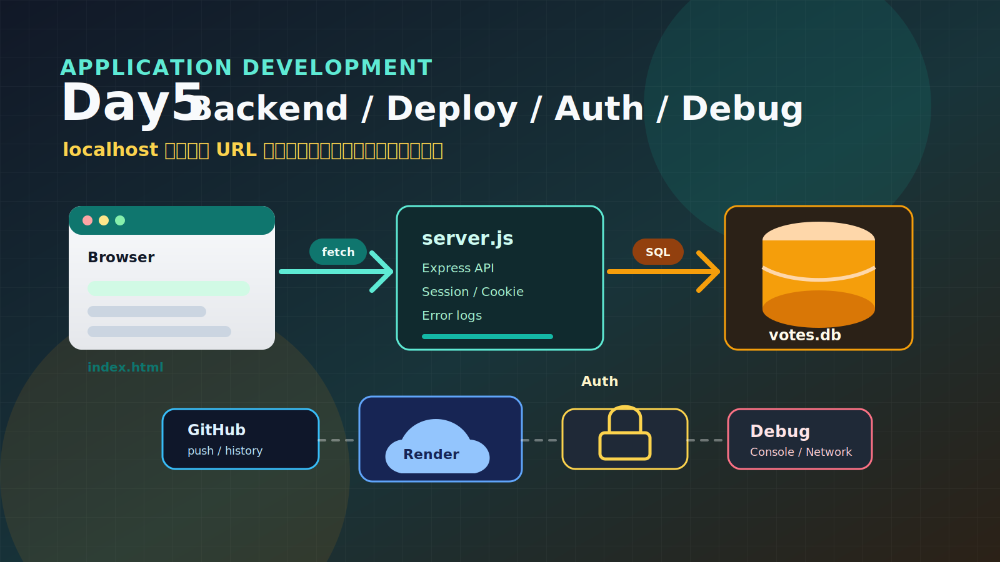

# Day5 アプリ開発発展②
## Day4 の定着・デプロイ・認証とデバッグ



---

## 今日やること（1コマ目）

- Day4 で作ったアプリの構成を「URL・サーバー・API・DB」の言葉で言い直す
- SQLite Viewer で `votes.db` を直接覗き、Git の流れと `.gitignore` を整理する
- 対話型 Gemini CLI（一発依頼ではなく段階を踏む使い方）を練習する
- 自分テーマで投票アプリをフロント＋サーバー＋DB まで作り直す
- **チャレンジ①**：自分で機能を 1 つ追加する

---

## 今日やること（2コマ目）

- 作ったアプリを **GitHub** に push し、**Render** で外部 URL に公開する
- 公開されたアプリの「何が危ないか」を考え、認証の必要性に気づく
- 現代の認証手法を俯瞰し、「**パスワード認証＋セッション**」を実装する
- **チャレンジ②**：変更してデプロイまで完結 / **チャレンジ③**：`/admin` を追加
- Day6 の総合演習に向けて自己チェック

---

## この日の位置づけ

- Day4 はセットアップに時間がかかり、演習時間が十分に取れなかった
- 1 コマ目：もう一度「フロント → サーバー → DB」の一連を**自分の手で**やり切る
- 2 コマ目：作ったアプリを **公開** → 「誰でも操作できる」問題に気づく → 認証を足す
- ハイブリッド形式。リモートからも同じ実習に取り組める

> Day6・Day7 の総合演習に必要な「フルスタックを自分で組める」状態をここで完成させる

---

## アイスブレイク

**この連休（GW）でいちばん良かったことは？**

- 現地・リモートともに **Slack** に投稿してください
- 講師がいくつかピックアップして読み上げます

---

## 最近の AI ニュース ①
### OpenAI Codex：AI がパソコン自体を操作する（2026年4月16日）

OpenAI が「Codex for almost everything」を発表。目玉は **background computer use**

- **自分のカーソルで画面を見て、クリックして、文字を入力できる**
- 別作業中に、**複数エージェントが Mac 上で並行**して動ける
- フロント修正・アプリのテスト・API のないアプリの操作も可能

> Day4 から使っている Gemini CLI は「チャットで依頼する」タイプ。Codex の新機能は「画面を見て自分でクリックする」タイプ

[](https://www.youtube.com/watch?v=D_FCYsshMI4)

▶ [OpenAI Codex — Computer Use（1分30秒）](https://www.youtube.com/watch?v=D_FCYsshMI4)

---

## 最近の AI ニュース ②
### Anthropic：Claude Code 上限倍増 × SpaceX 大型契約（2026年5月6日）

- Pro・Max・Team・Enterprise で **5 時間あたりの利用上限が 2 倍**
- ピーク時間帯の制限も撤廃
- Claude Opus の API 入力トークン上限：3 万 → **50 万 / 分**

背景：**SpaceX の「Colossus 1」**（300 MW 以上・GPU 22 万台超）を丸ごと借りる契約。今後は宇宙空間での計算基盤整備も検討

> 「ロケットの SpaceX」が「AI の Anthropic」に計算資源を貸す異業種連携。Gemini CLI（Google）と Claude Code（Anthropic）は AI コーディングエージェント市場で激しく競争中

---

## Day4 のフォルダを VSCode で開く

講義中は**手元で同じフォルダを開いて**、コードを見ながら聞いてください

🖱 **VSCode**

1. メニュー「ファイル」→「フォルダを開く」
2. Day4 で作ったフォルダ（例：`app-dev-day4`）を選んで開く
3. エクスプローラに `index.html` / `server.js` / `votes.db` が見えれば OK

> フォルダが見つからなければデスクトップ・書類フォルダを確認。それでも無ければ講師に声をかけてください

---

## URL の違いが表すこと

Day4 の途中で「アプリの開き方」が変わったことに気づいたか？

| | URL の見た目 | 意味 |
| --- | --- | --- |
| フロントのみ | `file:///Users/...` | OS のファイルを直接ブラウザが開いている |
| バックエンド有 | `http://localhost:3000` | ローカルで動くサーバーと HTTP 通信 |
| デプロイ後 | `https://〇〇.onrender.com` | インターネット上のサーバーと HTTP 通信 |

- `http://` から始まる ＝ 「**サーバーと通信している**」サイン
- `localhost` ＝ 自分のパソコン、`3000` ＝ ポート番号

---

## ローカル開発のコンポーネント図


- `file://` のままでは fetch でサーバーにリクエストを送れない
- `http://localhost:3000` を経由して初めてフロントと DB がつながる

> **なぜ `file://` で fetch できないか**：ブラウザのセキュリティ（同一オリジンポリシー）。`http://localhost:3000` 経由なら同じオリジンの通信になるので許可される

---

## 3 層構成：それぞれの役割

| 層 | ファイル | 役割 |
| --- | --- | --- |
| フロントエンド | `index.html` | 画面表示・ユーザー操作を受け付ける |
| バックエンド | `server.js` | リクエストを受け取り、DB に問い合わせ・結果を返す |
| データベース | `votes.db` | データを永続的に保存する |

この 3 層の言葉で Day4 のアプリを言い直せれば OK

---

## サーバーとは何か

> 「**常に起動していて、リクエストを受け取って返事を返すプログラム**」

身近なたとえ：

- レストランの**厨房**：注文（リクエスト）が来たら料理（レスポンス）を返す
- **電話窓口**：問い合わせを受け付けて回答する

| 言葉 | 意味 |
| --- | --- |
| サーバー（機械） | 24 時間動いている物理的なコンピュータ |
| サーバー（プログラム） | その上で動く「リクエストに返事を返す」プログラム |

Day4 の `server.js` は後者。Node.js の上で動く

---

## API とは何か・今日作る API（メニュー表）

**API**（Application Programming Interface）＝ プログラム同士の**窓口**。「どの URL に・どんなメソッドで頼むと・どんな形式で返るか」を決めた仕様

| API | 役割 | 返るもの |
| --- | --- | --- |
| `GET /votes` | 集計結果を取得 | JSON 配列（option と count） |
| `POST /vote` | 投票を 1 件登録 | `{ success: true }` |
| `POST /login` | ログイン | リダイレクト |
| `POST /logout` | ログアウト | リダイレクト |

ブラウザは「メニューに載っているもの」だけを頼める

---

## なぜサーバー・API が必要なのか

フロントエンドだけだと困ること：

| 問題 | 理由 |
| --- | --- |
| データを永続化できない | ブラウザのメモリは閉じれば消える |
| データを共有できない | 別の人のブラウザは別のメモリ |
| 秘密情報を守れない | 開発者ツールで誰でも見られる |
| 重い処理に向かない | 端末性能に依存・安定実行できない |

サーバーがあれば → 1 か所に集めて永続化・誰でも参照・秘密は隠す・安定実行

---

## サーバーは「窓口・警備員」


DB を直接ブラウザに公開してはいけない理由：

- 誰でも全テーブルを `SELECT` できてしまう
- 誰でも `DELETE` / `UPDATE` で書き換えられる
- DB のパスワードがフロントから見えてしまう

> **覚えておきたい**：フロントは「誰でも見られる場所」、サーバーは「自分のコードだけが知っている場所」。秘密・パスワード・API キーはすべてサーバー側に置く

---

## データベースを見てみる【実習 10 分】

🖱 **VSCode**

1. 拡張機能（`⇧⌘X` / `Ctrl+Shift+X`）で `SQLite Viewer` を検索してインストール
2. Day4 のフォルダを開く
3. エクスプローラで `votes.db` をクリック → 自動で SQLite Viewer が開く
4. テーブル名（`votes` など）をクリックして中身を確認

| 見るポイント | 内容 |
| --- | --- |
| テーブル名 | どんな名前か |
| カラム名 | `id` / `option` / `created_at` など |
| 行データ | 投票が 1 行ずつ並んでいる |

> SQL のテーブルは「表計算ソフトのシート」と同じ構造

---

## SQL を Gemini CLI で試す（1/2）：取得・件数

💬 **Gemini CLI** ― 全件取得

```
votes.db に接続して、votes テーブルの中身を全件表示して。
```

💬 件数を数える

```
votes テーブルに何件のデータが入っているか数えて。
```

→ 出力された結果を SQLite Viewer の画面と見比べる

---

## SQL を Gemini CLI で試す（2/2）：追加

💬 1 件追加してみる

```
votes テーブルに「ラーメン」という選択肢のデータを 1 件追加して。
```

→ SQLite Viewer の更新ボタンで行が増えたことを確認

> **ここで掴んでほしいこと**：SQL（`INSERT`・`SELECT`）はデータの「追加」「取得」を指示する言語。`server.js` の中でも同じ SQL が使われている

---

## Git の流れ（VSCode での操作）

| 操作 | VSCode | コマンド |
| --- | --- | --- |
| 初期化 | Source Control → Initialize Repository | `git init` |
| 変更を確認 | Changes パネル | `git status` |
| ステージング | `+` ボタン | `git add` |
| コミット | メッセージ → ✓ | `git commit -m "..."` |

> ファイル編集 → ステージング → コミットを繰り返す。VSCode のボタン操作と裏で動くコマンドの対応を意識する

---

## `.gitignore` に入れるもの

| 種類 | 例 | 理由 |
| --- | --- | --- |
| 生成物 | `node_modules/` | 再生成できる・巨大 |
| データ | `votes.db` | 実行時に作られる |
| 秘密 | `.env` | 漏洩すると致命的 |
| OS | `.DS_Store` / `Thumbs.db` | 他人の環境で不要 |

💬 Gemini CLI への依頼例：

```
このプロジェクト用の .gitignore を作って。Node.js + Express + SQLite のプロジェクトです。
```

---

## server.js を「流れ」で読む

1 行ずつ覚える必要はない。**「リクエストが来てから返事まで」**をイメージできれば OK

**フェーズ A：起動時に 1 回だけ**

1. ライブラリ読み込み（Express・better-sqlite3）
2. DB に接続（`votes.db` を開く）
3. テーブルが無ければ作る（`CREATE TABLE IF NOT EXISTS`）
4. ポート 3000 で待ち受け開始（`app.listen(3000)`）

**フェーズ B：リクエストが来るたびに**

| ルール | 意味 |
| --- | --- |
| `app.get('/votes', ...)` | 集計結果を返す |
| `app.post('/vote', ...)` | DB に保存する |
| `app.use(express.static('.'))` | ファイル（HTML 等）を返す |

---

## 詳細は Gemini CLI に聞く

行ごとの細部は覚えなくていい。**わからない部分は Gemini CLI に説明させる**

💬 流れの説明

```
server.js を読んで、リクエストが来てから返事を返すまでの流れを、
ステップごとに日本語で説明して。
初心者でもわかるように、専門用語が出てきたら都度説明してください。
```

💬 ピンポイント質問

```
app.use(express.json()) は何をしているコード？
これがないとどうなる？
```

「コードを読む練習」と「Gemini CLI への質問の練習」を兼ねる

---

## 対話型 Gemini CLI：悪い例

Day4 では「作って」と一言で頼むパターンが多かった

```
投票アプリを作って
```

→ 何を作るかが曖昧。意図と違うものが出てきても気づきにくい。動かなくても **どこを直せばいいか分からない**

今日は「**段階を踏んで対話する**」使い方を練習する

---

## 対話型 Gemini CLI：良い例（1/2）

**Step 1：現状を確認させる**

```
いまのフォルダの構成を確認して、何のプロジェクトか教えて。
```

**Step 2：変更案を出させる（まだ変更しない）**

```
投票アプリの選択肢を「ラーメン / 寿司 / カレー」から
「コーヒー / 紅茶 / 緑茶」に変えたい。
どのファイルのどの部分を変えればいいか教えて。
まだファイルは変更しないでください。
```

---

## 対話型 Gemini CLI：良い例（2/2）

**Step 3：差分で変更を依頼**

```
問題なさそうです。変更してください。
```

**Step 4：VSCode の diff ビューで確認 → 受け入れる**

- Source Control のファイル名をクリックして差分を見る
- 意図した変更かどうかを確認する
- 問題なければ保存

> 「Step 2 で案を出させて、確認してから Step 3 で変更させる」のが対話型のキモ

---

## エラーが出たときの対話例

エラーメッセージをそのまま貼り付ける

```
node server.js を実行したら以下のエラーが出ました。
原因と修正方法を教えて。

Error: Cannot find module 'express'
    at Function.Module._resolveFilename ...
```

→ **エラー文をコピペ + 「原因と修正方法を教えて」** が基本テンプレート

---

## 再実践：自分テーマで作り直す

Day4 と同じ構成（フロント + Node.js + SQLite）を **自分のテーマ**で作る

要件：「**複数人が答えを送れる**」「**送った内容がリロード後も残る**」

テーマ例：

- 「今週のランチ、何が食べたい？」（選択肢から投票）
- 「今日の授業の難しさは？」（5 段階アンケート）
- 「一言メッセージを残そう」（自由テキストの収集）
- 「好きな季節は？」（選択肢から投票）

凡例：💬 Gemini CLI ／ 🖱 VSCode の GUI ／ ▶ 別ターミナル（サーバー起動時）

---

## Step 0〜3：フォルダ作成 → index.html → 最初のコミット

**Step 0**：デスクトップに `app-dev-day5` を作成 → VSCode で開く → 統合ターミナルで `gemini` 起動 → Source Control で Initialize Repository

**Step 1**：💬 `3.0 というフォルダを作って。`

**Step 2**：💬 構成案を聞く → 提案を確認 → `その構成で作ってください。フレームワークは使わず 1 つの HTML にまとめてください。`

**Step 3**：💬 `このプロジェクト用の .gitignore を作って。Node.js + Express + SQLite のプロジェクトです。` → ステージング → コミット（例：`index.html の初期実装`）

---

## Step 4〜6：server.js → npm install → 起動

**Step 4**：💬 `server.js` を作る

```
3.0フォルダ内で Node.js + Express + better-sqlite3 で投票アプリのバックエンドを作って。
- POST /vote で option を受け取り votes.db に保存
- GET /votes で option ごとの集計を JSON で返す
- index.html を静的配信、localhost:3000、テーブル自動作成
他はまだ作らないで。
```

**Step 5**：💬 `npm install を実行して、必要なパッケージをインストールして。`

**Step 6**：💬 `server.js を起動して。`（▶ 別ターミナルでバックグラウンド実行）

---

## Step 7〜8：fetch で接続 → 動作確認

**Step 7**：💬 段階を踏んで依頼

```
index.html のボタンクリック時に POST /vote を fetch で呼び出して。
ページ読み込み時に GET /votes を呼び出して集計結果を表示して。
fetch を使って非同期で処理すること。
まず変更案を説明してから、確認を取ってから変更してください。
```

**Step 8**：動作確認

1. `http://localhost:3000` を開く
2. 投票ボタン → 集計が更新
3. **リロードしてもデータが残る**（「消えた」問題の解消）
4. Source Control でコミット（例：`サーバーと接続・データ永続化`）

---

## チャレンジ①：機能を 1 つ追加してみよう【15 分】

Step 1〜8 で作ったアプリに、**自分で考えた機能を 1 つ追加**

| 候補 | 内容 |
| --- | --- |
| A：リセットボタン | 全投票を 0 に戻す（DELETE エンドポイント） |
| B：棒グラフ表示 | 票数を CSS で横棒グラフ風に視覚化 |
| C：1 位をハイライト | 最多票だけ色やスタイルを変える |

**進め方**

1. 💬 「〇〇を追加したい。何をすればいい？ まだ変更しないで。」
2. 提案を確認 → `変更してください。`
3. 動作確認 → コミット（例：`リセット機能を追加`）

---

## デバッグ：まず構成図で全体像を把握

エラーが出ても、自分でコードを直す必要はない。**Gemini CLI と会話**で解決する

💬 構成を図化してもらう

```
今のプロジェクトの構成を Mermaid の図で表してください。
ブラウザ・サーバー・データベースの関係と、
それぞれの間でどんなやりとり（リクエスト・SQL）が起きているかを含めてください。
```

→ [mermaid.live](https://mermaid.live) に貼って表示 / VSCode の Mermaid プレビュー拡張でも可


---

## デバッグの流れ

**① エラーメッセージをコピー**：VSCode ターミナルの赤い文字を選択

**② Gemini CLI に原因を聞く**

```
以下のエラーが出ました。原因を教えてください。

（エラーメッセージをここにペースト）
```

**③ 説明が難しければ聞き返す**：`もっと簡単に教えてください。`

**④ 理解できたら直してもらう**：`原因はわかりました。修正してください。`

> 自分でエラーを読んで理解しようとしなくていい。「聞く → 直してもらう」の繰り返しがデバッグの基本

---

# 休憩

---

## デプロイとは

今のアプリは `localhost:3000` ＝ **自分のパソコンの中だけ**

他の人に使ってもらうには：ローカルのコード → **GitHub** → **Render** で起動


---

## GitHub とは

コードをインターネット上に保管・管理するサービス

| | ローカルの `.git` | GitHub |
| --- | --- | --- |
| 場所 | 自分のパソコン | インターネット上のサーバー |
| 役割 | 履歴を手元で管理 | クラウドに保存・共有 |
| アクセス | 自分だけ | URL を知っていれば誰でも（Public の場合） |

メリット：バックアップ・Render と連携した自動デプロイ・URL で共有・履歴で過去に戻れる・チーム開発（Day6・7 で活用）

「コミットを GitHub に送る」＝ **プッシュ（push）**

---

## GitHub のリスク：`.env` の流出

Public リポジトリの中身は **世界中の誰でも読める**。絶対に含めてはいけないもの：

| 種類 | 例 |
| --- | --- |
| 秘密情報 | パスワード・API キー・セッションシークレット |
| 個人情報 | 氏名・住所・メールアドレス |
| 認証情報 | サービスのトークン・秘密鍵（`.pem`） |
| DB の中身 | 個人情報が入った `.db` |

例：`SESSION_SECRET=abc123` や `ADMIN_PASSWORD=password` が `.env` ごと公開 → 不正アクセスや課金爆発の事例多数

> **⚠️ 一度プッシュした秘密情報は取り戻せない**。`.gitignore` に `.env` を**必ず**含める

---

## GitHub にプッシュする

🖱 **VSCode**

1. Source Control パネルを開く（`⇧⌘G` / `Ctrl+Shift+G`）
2. パネル上部 `…` → ビュー → **Source Control リポジトリ** を有効化
3. リポジトリ名横の **雲アイコン（ブランチの発行）** をクリック
4. **GitHub にサインイン** → ブラウザで Authorize
5. **Public リポジトリとして発行** を選択
6. リポジトリ名を確認して Enter（例：`app-dev-day5`）

✅ 確認：`https://github.com/<your-account>/app-dev-day5` を開いて `server.js` 等が見える / **`.env` が無いことを必ず確認**

---

## Render とは

GitHub と連携してアプリを公開できるクラウドサービス

| | ローカル | Render |
| --- | --- | --- |
| アクセス | 自分だけ | URL を知っている誰でも |
| 起動 | `node server.js` 手動 | push で自動デプロイ |
| URL | `localhost:3000` | `https://〇〇.onrender.com` |

→ コードを GitHub に push するだけで、外部 URL で公開されたアプリが自動的に更新される

---

## Render 無料プランの制限

授業では無料プランを使う。以下の制限を把握しておく：

| 制限 | 内容 |
| --- | --- |
| **スリープ** | 15 分アクセス無しで自動停止・次回起動 30〜60 秒 |
| **永続化なし** | 再デプロイで `votes.db` がリセット |
| リソース | CPU・メモリが少ない |
| 帯域 | 月 100 GB（授業規模では十分） |

> 本番では SQLite ではなく PostgreSQL などの DB サーバーを別に立てて永続化に対応する

---

## Web Service を作成する

1. ダッシュボード → **New +** → **Web Service** → GitHub 連携で `app-dev-day5` を選択
2. 以下のように設定して **Deploy Web Service**

| 設定項目 | 入力値 |
| --- | --- |
| Name | `app-dev-day5`（任意） |
| Language | `Node` |
| Branch | `main` |
| **Root Directory** | **`3.0`** |
| Build Command | `npm install` |
| Start Command | `node server.js` |
| Instance Type | `Free` |

> **Root Directory `3.0` 必須**：`server.js` はサブフォルダにあるため

---

## デプロイ確認 + チャレンジ②【15 分】

デプロイ完了後 `https://app-dev-day5-xxxx.onrender.com` が表示される

1. URL をブラウザで開く → 投票して **リロードでデータが残る**
2. URL を **Slack でクラスメートに共有** → 複数人で投票

**チャレンジ②**：質問文か選択肢のテキストを 1 つ変更し、**自分の手で**完結させる

1. ファイル変更（💬 か 🖱 どちらでも）
2. Source Control でコミット
3. 💬 `git push を実行して。`
4. Render が自動デプロイ（1〜3 分）
5. 外部 URL で変更を確認

---

## 問いかけ：公開したアプリの何が危ないか

URL を知っていれば、いま誰でも以下のことができる：

- **何百回でも投票できる**（ボット投票し放題）
- `POST /vote` に直接リクエストして**存在しない選択肢**のデータを追加できる
- 「集計をリセット」エンドポイントを作ったら、誰でも消せる
- 個人情報や有料機能があれば、なりすまし操作も可能

**「このアプリが本当に多くの人に使われたら、どんな問題が起きるか？」**

→ Slack に投稿してください

---

## 認証（Authentication）と認可（Authorization）

混同しがちだが**別物**。両方そろって初めて「守られたアプリ」になる

| 用語 | 意味 | やっていること | 例 |
| --- | --- | --- | --- |
| **認証** AuthN | あなたは誰？ | 本人確認 | パスワードで admin だと確認 |
| **認可** AuthZ | この操作していい？ | 権限チェック | admin だから「リセット」を押せる |

```
認証：本人かどうか     （門の前での本人確認）
認可：何ができるか     （建物に入った後、どの部屋に入れるか）
```

**今日：主に「認証」を実装** ／ 「認可」は `/admin` の保護で軽く触れる

---

## 現代の Web で使われる認証手法（俯瞰）

実装する前に「世の中にどんな方式があるか」を把握する

| # | 方式 | 仕組み | 使われる場面 |
| --- | --- | --- | --- |
| ① | **パスワード＋セッション** | ID/PW → セッション + Cookie | 多くの Web サービス |
| ② | **API キー / トークン** | ヘッダに秘密キー | 機械間通信（OpenAI・Stripe） |
| ③ | **JWT** | 署名済みトークンを毎回送る | SPA・モバイル・マイクロサービス |
| ④ | **OAuth / SSO** | 外部サービスに認証を委譲 | 「Sign in with Google」 |
| ⑤ | **MFA / 2FA** | パスワード + SMS / TOTP / FIDO | 銀行・SNS の二段階認証 |
| ⑥ | **パスワードレス** | パスキー・マジックリンク | Apple ID・Slack |

実サービスは複数を組み合わせる（例：一般ユーザー ① + ⑤、管理者 ⑥）

---

## 今日扱うのは「① パスワード認証 + セッション」

なぜこれから始めるか：

1. **最も普遍的**：ほぼ全ての Web サービスにある形式
2. **基礎概念が全部含まれる**：検証・セッション・Cookie・リダイレクト・保護
3. **可視化しやすい**：ログインフォームという目に見える UI
4. **授業時間で完結**：Gemini CLI の支援込みで 1 コマ目相当で動く

ここを理解できれば、JWT も OAuth も MFA も土台が出来る

---

## セッションとは

「ログイン中という状態をサーバーが覚えておく仕組み」

イメージは **イベントのリストバンド**

| 役割 | イベント | Web |
| --- | --- | --- |
| 本人確認 | チケットを見せる | ID・パスワードを送信 |
| 証明書発行 | リストバンドを渡す | セッション ID を Cookie に保存 |
| 以降の確認 | リストバンドを見せる | Cookie が自動送信される |
| 退場 | リストバンドを外す | セッション削除（ログアウト） |


---

## 認証で守るべきポイント

「動くだけ」のログインは作れる。本番運用で求められる勘所：

| 項目 | やるべき | 今日の授業では |
| --- | --- | --- |
| パスワード保管 | **ハッシュ化**（bcrypt 等） | 学習用に平文（`.env`）／本番 NG と明示 |
| 通信暗号化 | **HTTPS** 必須 | Render が自動で HTTPS |
| Cookie 属性 | `httpOnly` / `secure` / `sameSite` | 余裕があれば触れる |
| セッションシークレット | 推測されにくい長い文字列 | `.env` で管理・Render に登録 |
| ブルートフォース | 試行回数の制限・遅延 | 今回は扱わない（事後学習トピック） |

> **本日のゴール**：「動くログインを作る・なぜ必要か説明できる」

---

## ログインを実装する：3 つのエンドポイント

| エンドポイント | 役割 |
| --- | --- |
| `GET /login` | ログインフォームを返す |
| `POST /login` | 認証情報を検証 → セッション開始 → `/` へリダイレクト |
| `POST /logout` | セッションを破棄 → `/login` へ戻す |

`/`（投票アプリ本体）はセッションが無ければ `/login` にリダイレクト

**認証情報は `.env` に書く**（コードに直書きしない）

```
SESSION_SECRET=（推測されにくい長い文字列）
ADMIN_USER=admin
ADMIN_PASS=password123
```

---

## Gemini CLI への依頼（プロンプト全文）

💬 **Gemini CLI**

```
ログインした時のみ投票アプリを表示できるようにしてください。

- express-session でセッション管理、シークレットは .env の SESSION_SECRET から
- 管理者の認証情報も .env から：ADMIN_USER / ADMIN_PASS

.env に以下を追加（無ければ作成）：
SESSION_SECRET=mysessionsecret
ADMIN_USER=admin
ADMIN_PASS=password123

.gitignore に .env と cookies.txt を追加。
npm install express-session dotenv も実行して。
```

---

## ローカルでの動作確認

💬 `サーバーを再起動して。` → 🖱 ブラウザで確認

| 確認項目 | 操作 | 期待する結果 |
| --- | --- | --- |
| ① ログインページ表示 | `/login` を開く | フォームが表示される |
| ② 正しい情報でログイン | `admin` / `password123` | `/` にリダイレクト・投票アプリ表示 |
| ③ ログアウト | ボタンをクリック | `/login` に戻る |
| ④ 未ログインで `/` | ログアウト後アクセス | `/login` にリダイレクト |
| ⑤ 間違ったパスワード | 違う値を入力 | エラーで弾かれる |

---

## 認証をデプロイに反映する

> ⚠️ **`.env` は GitHub にも Render にも送られない**（`.gitignore` 対象）
> Render 側に**環境変数を別途登録**する必要がある

**Step 1**：コミット → 💬 `git push を実行して。`

**Step 2**：Render ダッシュボード → 対象サービス → **Environment** → Add Environment Variable

| Key | Value 例 |
| --- | --- |
| `SESSION_SECRET` | `mysessionsecret`（本番は推測されにくい値に） |
| `ADMIN_USER` | `admin` |
| `ADMIN_PASS` | `password123` |

→ 保存で自動再起動 → 外部 URL `/login` で動作確認 / GitHub に `.env` が無いことも確認

---

## チャレンジ③：管理ページを追加してみよう【10 分】

ログイン済みの場合のみアクセスできる `/admin` を新たに作る

| アイデア例 | 内容 |
| --- | --- |
| 投票集計のリセット | ボタンで `votes` を全件削除 |
| 投票一覧表示 | `voted_at` 付きで全投票を一覧 |
| ログインユーザー名表示 | 「ログイン中：admin」 |

進め方：

1. 💬 「ログイン済みの場合のみアクセスできる /admin ページを追加したい。どう実装すればいい？ まだ変更しないで。」
2. 提案を確認 → 実装を依頼
3. ブラウザで動作確認 → コミット

✅ 確認：`/admin` がログイン後だけ見える / 未ログインだと `/login` にリダイレクト

---

## 自己チェック【2 分】

Slack に「できる / 怪しい / まだわからない」で投稿してください

```
① .gitignore に何を入れるべきかを説明できる
② Gemini CLI と対話的に進められた（一発で全部頼まず、段階を踏めた）
③ エラーを Gemini CLI に貼り付けて原因を聞き、修正を依頼する流れで対処できた
④ GitHub にプッシュできた
⑤ Render にデプロイして外部 URL でアクセスできた
⑥ 認証なしで公開することのリスクを説明できる
⑦ /login でログインして投票アプリが表示された／未ログインで /login にリダイレクトされた
⑧ .env の値を Render の環境変数に登録して、外部 URL でもログインできた
```

「怪しい」「まだわからない」が多かった項目は Day6 の冒頭でフォローします

---

## Day6 予告 + 締め

今日できた構成：


Day6・Day7（総合演習）でやること：

- 自分でテーマを決めて、このフルスタック構成を使う
- 「**誰のどんな課題を解決するか**」から設計して実装する

**締め**：今日詰まったポイント・疑問を Slack に 1 行書いてください（Day6 冒頭で取り上げます）
